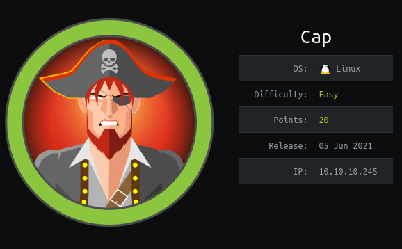
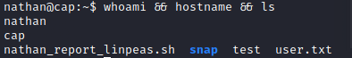

# Box 




https://www.hackthebox.eu/home/machines/profile/351

# Profile

  

https://www.hackthebox.eu/home/users/profile/296177

# Table of contents

* [Reconnaissance](#reconnaissance)
* [Exploitation](#exploitation)
* [Post-Exploitation](#post-exploitation)
  + [User](#user)
  + [Root](#root)

# Contents 

## Reconnaissance

Let's start with nmap :

```bash
nmap -sV -sC -Pn --top-ports 1000 -oN scan_10.10.10.245 10.10.10.245
```


Getting on the website we can see a Security dashboard : 


There are 3 main sections, in `IP config` we can see the IP of the our remote machine,  in `Network status` the result of a netstat  and in `Security Snapshot` we can download .pcap files that we can analyze. 


Before doing anything on the website, let's check if we can get a login in the ftp. 


I tried several default logins with `admin` `nathan` or `root` as user or password but it didn't work. Back to our website. We can see in the url that we have a uri `/data/X`. Let's start with 0. 

## Exploitation

 We have a ftp server so before let's  see if there are raw informations that we can get with strings. 

````bash
strings 0.pcap | egrep  'USER|PASS' | cut -d ' ' -f2 | tr  '\n' ' '
````


| User   | Password        |
| ------ | --------------- |
| nathan | Buck3tH4TF0RM3! |

Let's try the password in the ftp first. 


## Post-Exploitation

### User

It seems that we have the home of the user `nathan` . Let's try with ssh then. 



To root.

### Root

Let's take a look at the webapp. 


We can modify the text in `app.py` . 


It seems that the application can run with a setuid of 0. We can then uncomment and modify the command to get a reverse_shell. 

Launch the application with`flask run` 


We need a ssh tunnel to get the website on our machine : 

```bash
ssh -L 5000:localhost:5000 nathan@10.10.10.245
```


Now go to the Security Snapshot section. 


Rooted.

We successfully got a root shell, let's seek for an explanation. Digging further in the box I found that the python version used was actually in a setuid. We can check this using :

```bash
getcap -r / 2 2>/dev/null
```


