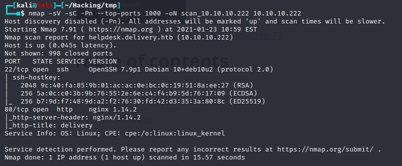

# Box 


https://www.hackthebox.eu/home/machines/profile/308

# Profile

  

https://www.hackthebox.eu/home/users/profile/296177

# Table of contents

* [Reconnaissance](#Reconnaissance)
* [Exploitation](#exploitation)
* [Post-Exploitation](#post-exploitation)
  + [User](#user)
  + [Root](#root)

# Contents 

## Reconnaissance

Let's start with a nmap :

````bash
nmap -sV -sC -Pn --top-ports 1000 -oN scan_10.10.10.222 10.10.10.222
````



We can see that there's a website open. Let's check it out


First of all, we find that the "helpdesk" button bring us to a subdomain called helpdesk.delivery.htb, so let's add it to our /etc/hosts file.


In the "contact us" section we can also find a mattermost server on the port 8065. http://delivery.htb:8065/login 

Also, there is  this message : 

```
For unregistered users, please use our HelpDesk to get in touch with our team. Once you have an @delivery.htb email address, you'll be able to have access to our MatterMost server.
```


Ok so we have 3 different website. Let's run a gobuster on all of them.


We can see that we have web.config file in the helpdesk subdomain. Let's take a look.


There are 2 interesting urls in this file we can see one called "Sites pages" and the other one called "Staff applications". We have a /api and a /scp page. It seems that /api redirect in the support ticket webpage but /scp bring us to a new webpage, the staff one ! 


We know need to find credentials. Let's try to see what we can do about the support ticket page by opening one issue.

## Exploitation


Ok so we get an id : 


Let's try to see our ticket :


We got an access denied.

Remember the message we saw earlier ? We need to have a @delivery.htb mail to login in the mattermost server. Let's try to register to this server now.


We got a page to resend a verification e-mail. Let's click on it once just to be sure. 


Get back on our ticket page and use the email you used to open the issue and the ticket id. For us it will be `test@mail.fr` and  `5466074`


We can now properly register by using the link in the ticket ! 

## Post-Exploitation

### User

After login in, we can read the team's messages : 


There are 2 interesting things. First of all, we've got  a credential `maildeliverer:Youve_G0t_Mail!`.

Secondly it seems that there is an easter egg. "PleaseSubscribe!" is often used in IppSec video. It seems that the root password may be a variant of this word. 

Let's try to use the credential in ssh. 


It works, we have the user.txt flag. Let's escalate to root.

### Root

After a while on the box, I find a config.json file that contains a login.


Here we can see that there is a login `mmuser:Crack_The_MM_Admin_PW`.

Let's try to use the login we have to get in the DB.

```bash
mysql -u mmuser -p 
```

We are in. 


We can see there is a mattermost database which is probably where the passwords are stored.

Typing `show tables` bring us a lot of tables but only one  is interesting : 


Let's get the columns name first :

```sql
SELECT COLUMN_NAME FROM INFORMATION_SCHEMA.COLUMNS WHERE TABLE_NAME = 'Users' 
```


We can see a username and password column. That's what we need.

```sql
SELECT username,password FROM Users
```


We got a root hash. 

```
$2a$10$VM6EeymRxJ29r8Wjkr8Dtev0O.1STWb4.4ScG.anuu7v0EFJwgjjO
```

We can see that it seems to be a bcrypt hash. To crack it, I first tried to use  the rockyou.txt list but it didn't work. Then we  need to remember what we saw about the "PleaseSubscribe!" word. It is probably a variant. I will use hashcat for this. 

To get the variant I will use a popular rule that we can find on github : 

https://github.com/NotSoSecure/password_cracking_rules/blob/master/OneRuleToRuleThemAll.rule

Create a wordlist with only "PleaseSubscribe!" in it and run hashcat with the rules or you can create a custom wordlist with the rules by using :  

https://github.com/llamasoft/HashcatRulesEngine

After creating a custom wordlist with the HashcatRulesEngine I run : 

```bash
hashcat -m 3200 hash.txt wl.txt 
```

We cracked it ! 

```
$2a$10$VM6EeymRxJ29r8Wjkr8Dtev0O.1STWb4.4ScG.anuu7v0EFJwgjjO:PleaseSubscribe!21
```

Now let's try to log in as root with this new password.


Rooted.