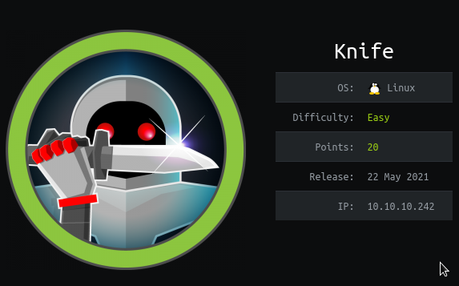

# Box 




https://www.hackthebox.eu/home/machines/profile/347

# Profile

  

https://www.hackthebox.eu/home/users/profile/296177

# Table of contents

* [Reconnaissance](#reconnaissance)
* [Exploitation](#exploitation)
* [Post-Exploitation](#post-exploitation)
  + [User](#user)
  + [Root](#root)

# Contents 

## Reconnaissance

Let's start with nmap :

```bash
nmap -sV -sC -Pn --top-ports 1000 -oN scan_10.10.10.242 10.10.10.242
```


We have a website : 


Nothing particular, so I launch burp and check the headers. 


Here we can see something weird. We have a version of PHP `8.1.0-dev` . Let's take a look on searchploit. 


It seems it is a vulnerable version. Let's grab the script and try it. (https://www.exploit-db.com/exploits/49933)

## Exploitation

We have a shell.


## Post-Exploitation

### User

It seems that we are the user but we do not have a proper shell.

So let's try to get out user ssh key.


I couldn't log in in ssh because it requires a password. So let's grab the user.txt :


### Root

Our user james can execute `/usr/bin/knife` as sudo : 


Searching for this binary we can execute ruby code to do it. 


Let's grab a reverse shell and paste it. 

I used this one :  https://github.com/secjohn/ruby-shells/blob/master/revshell.rb

Upload your reverse shell in the machine.


Let's get our flag.


Rooted.

