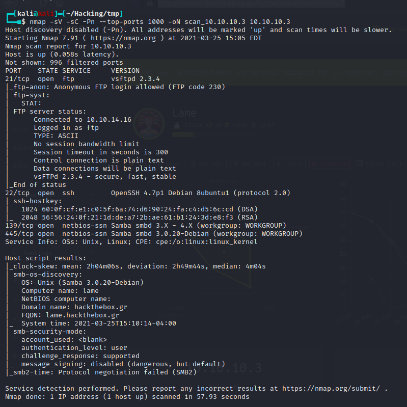
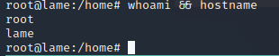

# Box 


https://www.hackthebox.eu/home/machines/profile/1

# Profile

  

https://www.hackthebox.eu/home/users/profile/296177

# Table of contents

* [Enumeration](#enumeration)
* [Exploitation](#exploitation)
  + [Root](#root)

# Contents 

## Enumeration

Let's start with nmap :

```bash
nmap -sV -sC -Pn --top-ports 1000 -oN scan_10.10.10.3 10.10.10.3
```



This box is really easy I've done it just for fun.

At first I tried the exploit the ftpd version but it didn't work.

https://www.exploit-db.com/exploits/17491

## Exploitation

### Root

By using searchsploit you can find an exploit on the SMB server.


Using metasploit to get our RCE we get a shell to root : 

