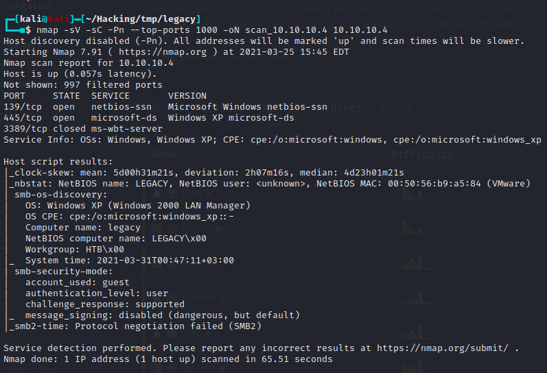
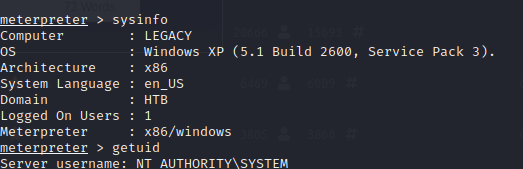

# Box 


https://www.hackthebox.eu/home/machines/profile/2

# Profile

  

https://www.hackthebox.eu/home/users/profile/296177

# Table of contents

* [Reconnaissance](#Reconnaissance)
* [Exploitation](#exploitation)
  + [Root](#root)

# Contents 

## Reconnaissance

Let's start with nmap :

```bash
nmap -sV -sC -Pn --top-ports 1000 -oN scan_10.10.10.4 10.10.10.4
```



After researching a bit, I found an exploit using smb1 on windows xp

## Exploitation

### Root

https://www.exploit-db.com/exploits/43970

After using it we are directly NT AUTHROITY\SYSTEM 

