# Box 


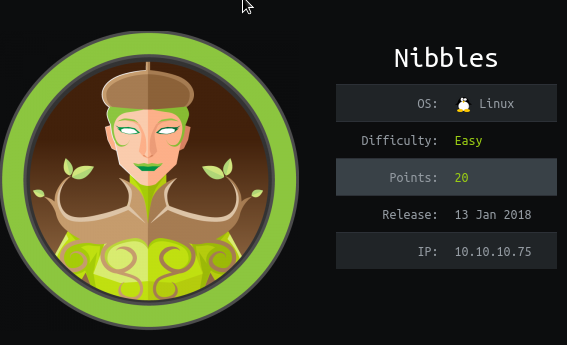

https://www.hackthebox.eu/home/machines/profile/121

# Profile

  

https://www.hackthebox.eu/home/users/profile/296177

# Table of contents

* [Reconnaissance](#Reconnaissance)
* [Exploitation](#exploitation)
* [Post-Exploitation](#post-exploitation)
  + [User](#user)
  + [Root](#root)

# Contents 

## Reconnaissance

Let's start with nmap :

```bash
nmap -sV -sC -Pn --top-ports 1000 -oN scan_10.10.10.75 10.10.10.75
```

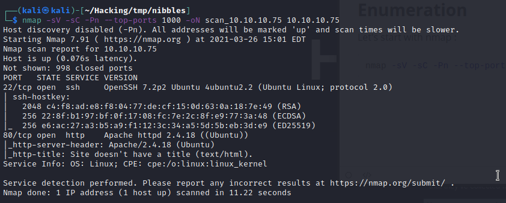

So we have a website : 

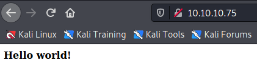

Let's check the source code :

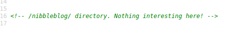

We now go the website : 

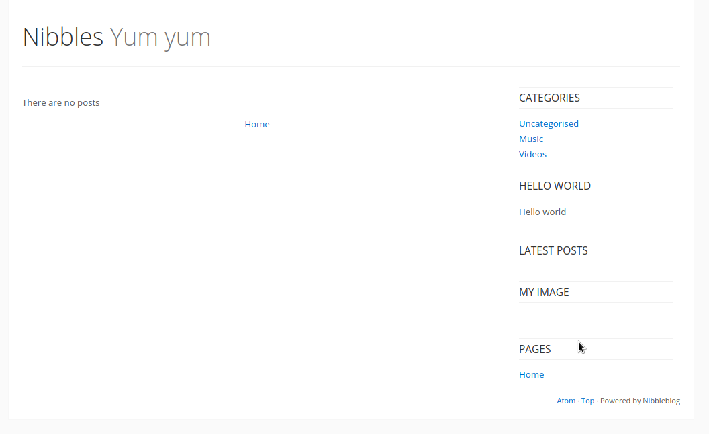

There is nothing interesting. Let's do some directory listing : 

```bash
ffuf -u http://10.10.10.75/nibbleblog/FUZZ -w /usr/share/seclists/Discovery/Web-Content/common.txt 
```


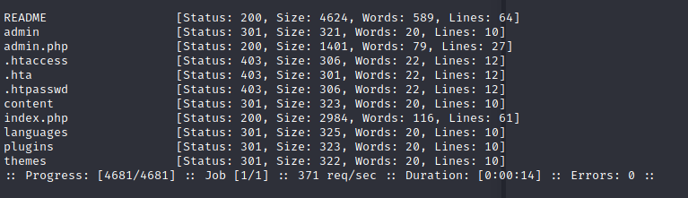


Let's read the README. 

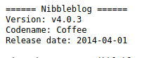

We find an exploit with this specific version but we need admin's credential. 

https://www.exploit-db.com/exploits/38489

## Exploitation

After trying to login too much on the admin.php page, I got banned.

I think bruteforcing is not the way to go.

After checking all the files I foud nothing... So I got back and tried a few password.

```bash
admin:nibblesblog
admin:nibbles
```

and admin:nibbles worked. We  can now use our exploit. 

Start metasploit and use :

```
use exploit/multi/http/nibbleblog_file_upload
```

you should get your shell : 

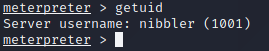

## Post-Exploitation

### User

We already are the user. 

We can get our flag.

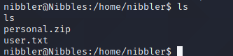

### Root

Let's do the classical  `sudo -l` :

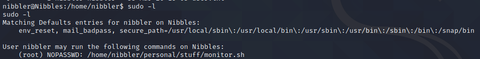

There is no script withe this path but we have a personal.zip folder that we can unzip.

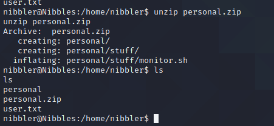

We now have full access to the script. Just edit it and remove the content. 

Add `/bin/bash` to the script and you are root.

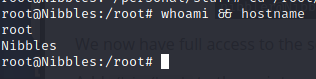

Rooted.