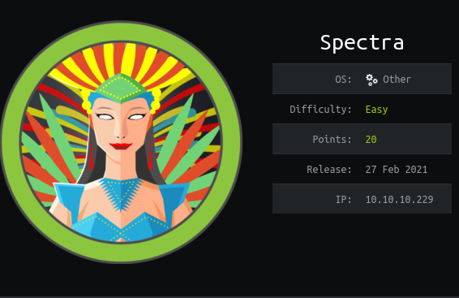

# Box 




https://www.hackthebox.eu/home/machines/profile/317

# Profile

  

https://www.hackthebox.eu/home/users/profile/296177

# Table of contents

* [Reconnaissance](#Reconnaissance)
* [Exploitation](#exploitation)
* [Post-Exploitation](#post-exploitation)
  + [User](#user)
  + [Root](#root)
* [Bonus](#bonus)

# Contents 

## Reconnaissance

Let's start with nmap :

```bash
nmap -sV -sC -Pn --top-ports 1000 -oN scan_10.10.10.229 10.10.10.229
```


Let's take a look at the website : 


I've found nothing on the website so I start listing directories by using fuff on the 2 websites, there are wordpress webistes so let's use a special wordlist : 

```bash
ffuf -w /usr/share/seclists/Discovery/Web-Content/CMS/wordpress.fuzz.txt -u http://spectra.htb/testing/FUZZ

ffuf -w /usr/share/seclists/Discovery/Web-Content/CMS/wordpress.fuzz.txt -u http://spectra.htb/main/FUZZ
```

After enumerating a lot on both websites, I found an interesting file :


I found this file using :

```bash
fuff   -u http://spectra.htb/testing/FUZZ -w /usr/share/seclists/Discovery/Web-Content/CMS/wordpress.fuzz.txt -mc 200,204,301,403,401,500 -e .bak,.old,.save,~
```

.save is the file extension for a temporary file using the nano editor. 

Looking at the webpage we have credentials : 


## Exploitation

I tried to use these credentials on `http://spectra.htb/main/wp-login/`page but it didn't work. I also tried to log in the DB directly but no success either. 

So I tried different combinations  :

```bash
admin:devteam01
admin:devtest
administrator:devteam01
```

and `administrator:devteam01` worked.

You are now successfully logged in as the admin of the website and can upload your reverse_shell.

You can follow this tutorial to know how : 

https://www.hacknos.com/wordpress-shell-upload/


Now we got our first reverse_shell.

## Post-Exploitation

### User

I tried to add my public key to the user nginx but it didn't work. It seems that every ssh user is redirected to the ssh folders of the user chronos.

After an Reconnaissance with LinPEAS we found a file with a password : 


Here are all our users :


I tried to log in with ssh and only katie worked : 

```
katie:SummerHereWeCome!!
```


### Root

Let's do the classical `sudo -l` :


We can use initctl as root. Let's take a look at job configuration in  `/etc/init/` that we own/can edit:


There are a lot of scripts that we can edit :


Let's check it out :


Let's add `cat /root/root.txt > /home/katie/root.txt` to the script part.
You have to add the line at the start of the `script`part. I think it is because when you launch the node server it doesn't exit. 

Now you can start with initctl your job. For example, I am using the test9.

```bash
sudo initctl start test9
```


We got our flag.

Rooted.

## Bonus

We got the flag, but no reverse_shell, what a shame ! 

Let's get to work, it shouldn't be too difficult.

By using the previous tecnique I got the `/etc/sudoers` downloaded it on my local machine.

Then we modify our sudoers file to get root permissions : 


Upload your `new_sudoers` file, and then reload the new sudoers in the `/etc` folder :  


You can now start a `sudo /bin/bash` and you should be right : 


