# Box 


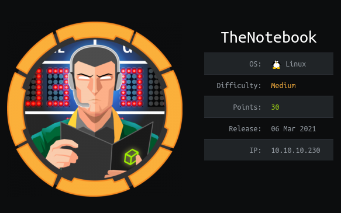

https://www.hackthebox.eu/home/machines/profile/320

# Profile

  

https://www.hackthebox.eu/home/users/profile/296177

# Table of contents

* [Reconnaissance](#Reconnaissance)
* [Exploitation](#exploitation)
* [Post-Exploitation](#post-exploitation)
  + [User](#user)
  + [Root](#root)

# Contents 

## Reconnaissance

Let's start with nmap :

```bash
nmap -sV -sC -Pn --top-ports 1000 -oN scan_10.10.10.230 10.10.10.230
```

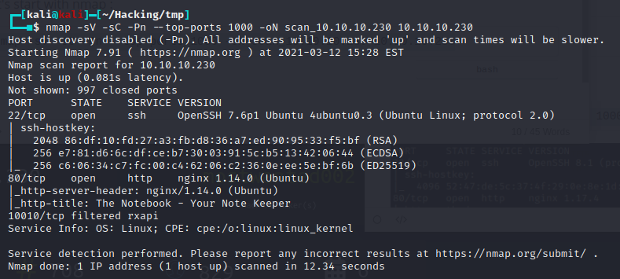

We got a webpage where we have to register and we can submit notes : 

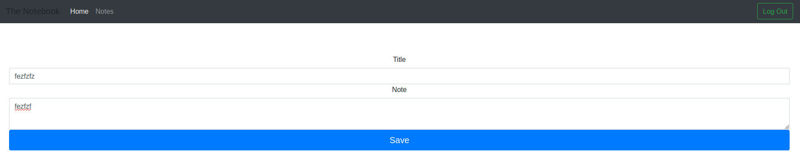

After enumerating  I found the admin page where we can make notes 

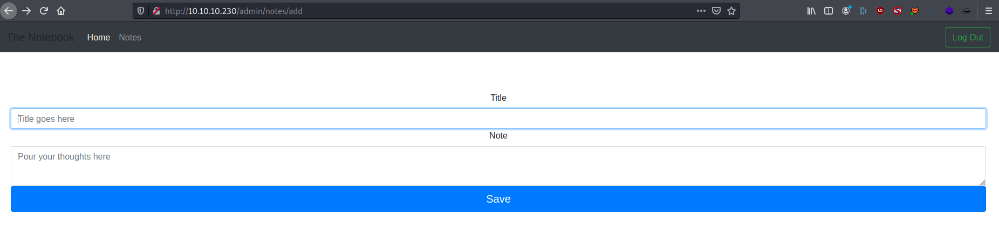

I found nothing else so I took a look  on the differents headers and cookies we have : 

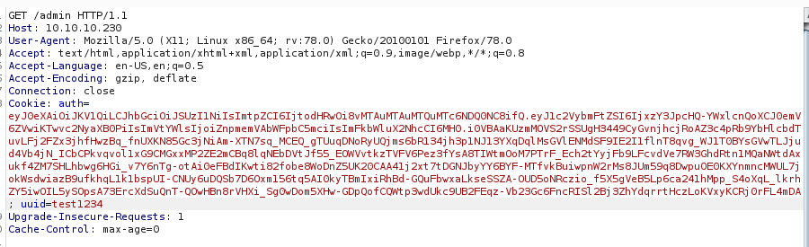


It seems that we have JWT token. Let's try to see if it's vulnerable.

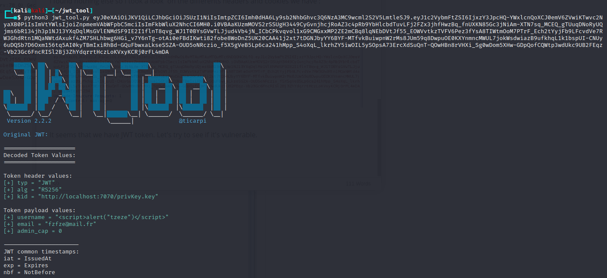

There is a field `kid = "http://localhost:7070/privKey.key"`, let's try to setup a python server on our machine and send a request. 

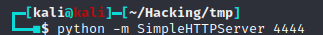

Change the kid value : 

```
kid = "http://10.10.14.17:4444/"
```

Well, we have a request. Let's try to get a reverse_shell now

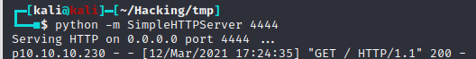

So we know we can modify this request to get to our own key.

We have to modify the `admin_cap` value to `1` and we have to modify the key used to verify the signature and generate our own pair of keys.

To generate a pair of key I used this link : https://gist.github.com/ygotthilf/baa58da5c3dd1f69fae9

## Exploitation

Then, you have to modify your JWT token (https://jwt.io/) like this : 

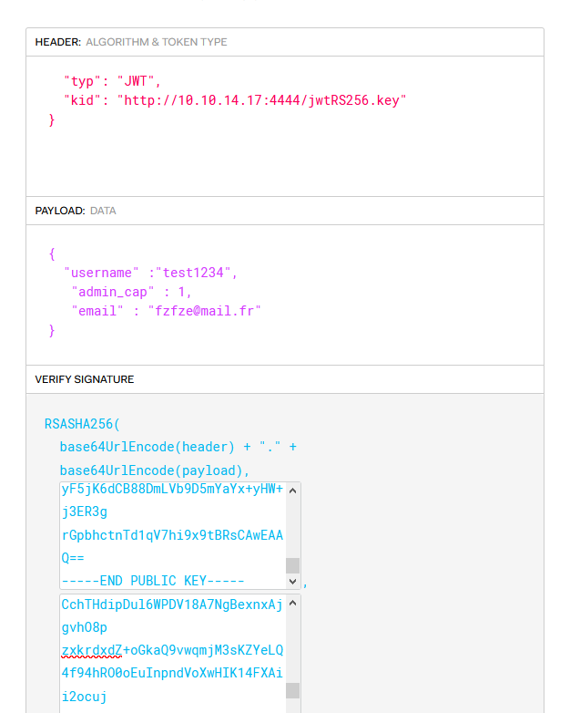

In the "verify signature" part you have to cat your keys and add the public and private key in plain text.

Then load your token in a burp request :

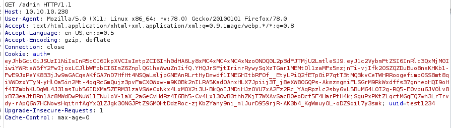

Send your request to the /admin and you should be fine ! 

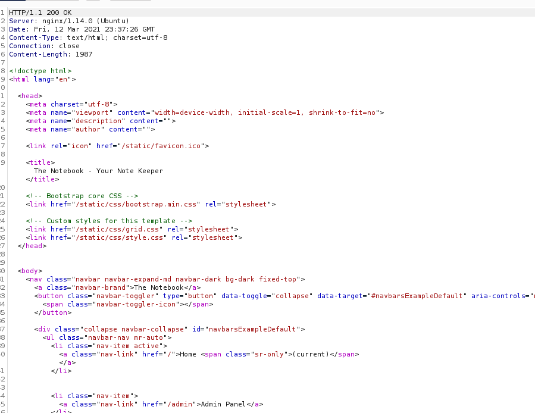


Earlier during my Reconnaissance I found a /upload file where I can upload my reverse shell : 

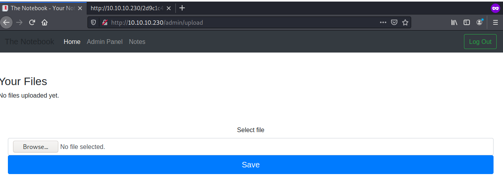

After uploading my reverse shell, we got in : 

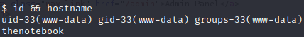

## Post-Exploitation

### User

After landing on the box, I did an Reconnaissance and found a file in `/var/backups` called `home.tar.gz`

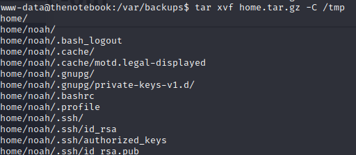

We know have the private key and we can log in as noah.

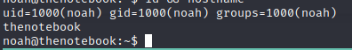

### Root

Let's do the classical `sudo -l` :

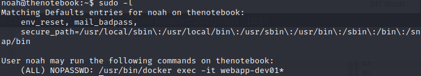

Well, we have a docker exec in sudo, it must be the way.

After a while I found a PoC of a specific CVE https://github.com/0xBADCA7/CVE-2019-5736-PoC

Using this link and the tutorial I modified the go script to have another payload 

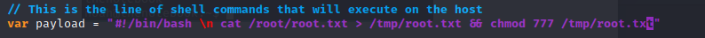

You start the exploit on your docker container : 

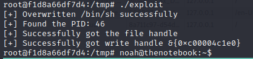


Execute your `/bin/sh` using your sudo docker exec:

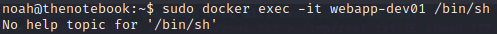

You got your flag.

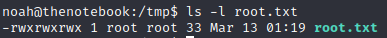

You can also modify the payload to have a reverse shell : 

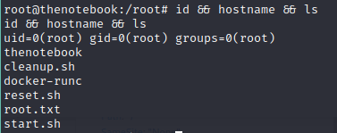

Rooted.